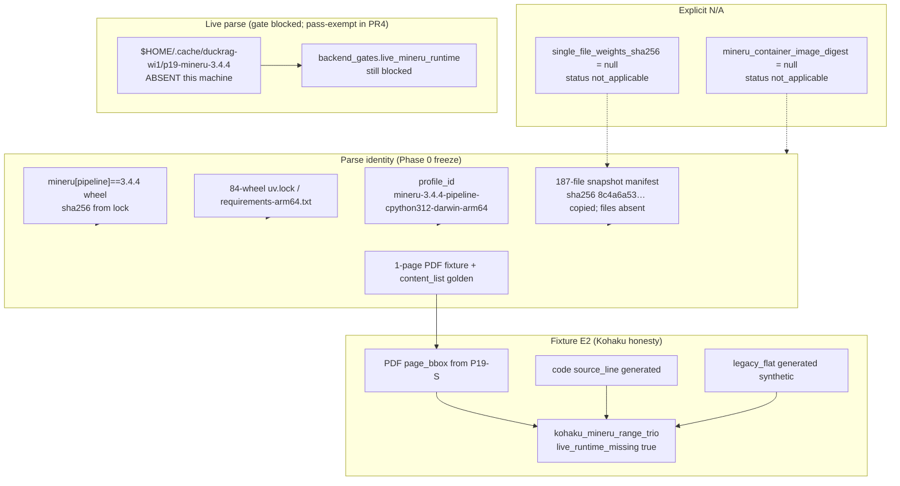
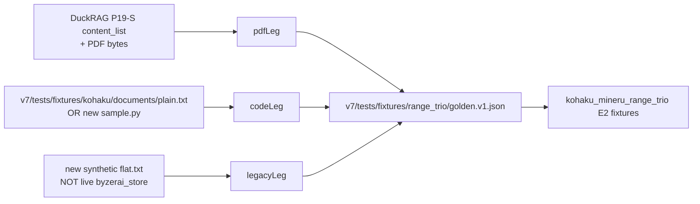

# Phase 0 MinerU 解阻设计（pg-agent v7）

| 字段 | 值 |
|---|---|
| Title | Close Phase 0 MinerU blockers by re-pinning wheel+snapshot identity |
| Author | Grok (design-only; not an implementation) |
| Date | 2026-08-30 |
| Status | Accepted（用户决策关闭 2026-08-30：Q1=Option B，Q2=keep blocked，Q3=copy p19-s.json） |
| Workspace | `/Users/wxl/Projects/pg-agent` |
| Authority | `docs/plans/flock-rag-on-duckdb-final-plan-v4.1.md`；canonical Phase 0 定义在 `v7/gates/phase0_evaluator.py` |
| Honesty template | `v7/migration/kohaku_tree_fixture.py` + `v7/evidence/kohaku_tree_fixtures.md` + `phase0_baseline_status.json` item `kohaku_tree_fixtures` |

本文是 **design/spec**，不是实现。工程师应能按本文改 evaluator / manifest / fixtures / 计划正文，而不再重做 DuckRAG 考古。禁止用聊天记忆填 SHA-256。本文所有 digest 均标注 **本机 2026-08-30 复算方式**；无法复算的字段明确标为 **copied identity / live files absent**。

---

## Overview

当前 `evaluate_phase0()` **失败**。`v7/README.md:5` 记录 2026-08-30 的 `passed_with_user_waiver` 只是流程标记，**evaluator 未改**。MinerU 相关 Phase 0 blocker 来自一组 **与 DuckRAG P19-S 真实身份矛盾** 的谓词：evaluator / v4.1 §3.2 仍要求 OCI `mineru_container_image_digest` 和 `single_file_weights_sha256`，并要求 `live_mineru_runtime` 达到 live E2。DuckRAG 已证明身份是 **`mineru[pipeline]==3.4.4` PyPI wheel + 84-wheel uv lock + 187-file PDF-Extract-Kit snapshot + 1-page bbox golden**，**不是** container runtime，也不是单文件 `*.safetensors`。

本设计做三件事（**可拆开落地**）：

1. **把 MinerU parse identity 重新钉到 wheel + lock + `profile_id` + snapshot manifest**。OCI digest 与 single-file weights 改为 **`not_applicable`（字段保留为 null，禁止编造 hash）**。
2. **按 Kohaku fixture 诚实模板** 冻结 PDF range-trio golden（从 P19-S canonical `content_list` 导入，不重跑 MinerU），并生成 code / legacy 两腿，使 `kohaku_mineru_range_trio` 作为 **fixtures E2** 关闭；`live_runtime_missing` 仍为 true。`evidence_components` **只**含 `live_or_fixture: {level: E2, kind: fixtures}`（抄 Kohaku，不带 contract 组件）。
3. **Option B 已定（2026-08-30）：** Phase 0 **不**把本机 15GB live 重配当作 MinerU 过关条件。`live_mineru_runtime` 继续诚实 blocked（kind=`runtime`）。PR1 把 “live 不是 Phase 0 pass predicate” 写入 v4.1 Phase 0 出口。PR2 **不含** pass-exempt。PR4 **必须**加入 `PHASE0_PASS_EXEMPT_BACKEND_GATES = frozenset({"live_mineru_runtime"})`，且 `evaluate_phase0()` dump 从 pass 列表去掉 `live_mineru_runtime` 与 `baseline.live_mineru_runtime`。

`canonical_mineru_contract_version` **保持 blocked**（用户 Q2）。`mineru.md` 没有 document-level version 字符串；Darwin `profile_id` 只写入非 §3.2 字段 `mineru_profile_id`。禁止发明 `flock-rag-mineru-contract/1`。该 configuration gap **不关闭**。

本设计 **不** 关闭 tachiom ABI、mdenseon live bytes、live `byzerai_store_duckdb.db`、`flock_abi_catalog_version`、NEAREST env、dirty provenance、11 条 open corrections、P19-E2E、`canonical_mineru_contract_version`。实施后 `phase0_pass` **仍为 false**。

---

## Background & Motivation

### 当前 Phase 0 真相源

| 工件 | 路径 | 本机观察（2026-08-30） |
|---|---|---|
| Evaluator | `v7/gates/phase0_evaluator.py` | `evaluate_phase0()` / `_evaluate_phase0_snapshot()` 是 `phase0_pass` 唯一权威 |
| Baseline | `v7/evidence/phase0_baseline_status.json` | `"phase0_pass": false`；schema `flock-rag-phase0-baseline-status/3` |
| Manifest | `v7/VERSION_MANIFEST.json` | MinerU 字段已从 DuckRAG lock **抄录**，但 completeness 仍 `blocked` / `partial` |
| 计划 | `docs/plans/flock-rag-on-duckdb-final-plan-v4.1.md` | §3.2 仍列 “MinerU container image digest”；Phase 0 出口是 contract **E0→E1**，不是 live parse E2 |
| Kohaku 模板 | `v7/tests/fixtures/kohaku/` + `v7/migration/kohaku_tree_fixture.py` | `kohaku_tree_fixtures` 已是 **E2 of generated fixtures**，`live_runtime_missing: true` |
| 合同 | `v7/evidence/contracts/mineru.md` | JSON ingest **E1**；live runtime **E0**；明确 “lock 无 container digest” |
| Waiver | `v7/README.md:5` | `passed_with_user_waiver`；evaluator 未改 |

`v7/mineru/contracts.py` **不存在**。`VERSION_MANIFEST.json:1042-1044` 因此把 `canonical_mineru_contract_version` 标为 blocked，并写明 “Do not invent a contract version string.” `mineru.md` 标题是 “MinerU ingestion contract (Phase 0 WI-3)”，**没有** contract version id；文中出现的 `3.4.4` / operator `config_version` `1.3.1` / Popo `_version_name=3.4.0` 都不是该 §3.2 字段。

### 失败谓词（MinerU 子集）

当前 baseline `blocker_ids` 中与 MinerU 直接相关的条目（`phase0_baseline_status.json:17-43`）：

| `blocker_id` | class | code | 触发函数 |
|---|---|---|---|
| `live_mineru_runtime` | `blockers` | `BACKEND_GATE_BLOCKED` | `_validate_backend_gates` 对 `REQUIRED_BACKEND_GATES`（evaluator:257-265） |
| `kohaku_mineru_range_trio` | `missing_baselines` | `BASELINE_MISSING_OR_UNAVAILABLE` | `_validate_baselines`；`acceptance_fixture_missing: true` |
| `baseline.live_mineru_runtime` | `missing_baselines` | `BASELINE_MISSING_OR_UNAVAILABLE` | 同上；`item_id` 也在 `REQUIRED_BACKEND_GATES` 时 blocker 改名为 `baseline.{id}`（evaluator:3063） |
| `mineru_container_image_digest` | `required_null_hashes` | `REQUIRED_HASH_UNAVAILABLE` | `required_null_hash_paths`（evaluator:912-925）+ `_validate_hashes`（3472-3482） |
| `mineru_model_name_version_weights_hash.single_file_weights_sha256` | `required_null_hashes` | `REQUIRED_HASH_UNAVAILABLE` | 嵌套 `None` 且 `HASH_KEY_RE` 匹配 `sha256` |
| `canonical_mineru_contract_version` | `configuration_gaps` | `CONFIG_UNRESOLVED` | `_config_unresolved`：`value is None`（3492-3497） |
| `range_trio_acceptance` | `blockers` | `BACKEND_GATE_BLOCKED` | 与 trio baseline 对齐 |

上表是 **七** 个 MinerU 相关 `blocker_id`（五个门禁/baseline + 两个 required-hash + 一个 config gap）。后文 after 表按落地切片删除子集，不说 “六项”。

`mineru_json_ingest` **已经** `blocked: false`、`evidence_level: E1`（`VERSION_MANIFEST.json:1201-1206`：`blocked: false`，`evidence_level: E1`，`not_e2: true`；1199 行是 `live_mineru_runtime.reason`）。这不是新缺口。

### 计划与 evaluator 的矛盾

v4.1 Phase 0 **出口**（计划约 1813-1820 行）：

- “MinerU/mdenseon/tachiom required contract从E0升级到E1”
- “任一required unknown未关闭时，相关backend不能进入实现”
- canonical evaluator 输出必须与 `phase0_pass` 完全相等

v4.1 §3.2 **Manifest 必备字段**（计划 227-230 行）和 F-10（traceability:40 行附近，**ABSORBED**）把 “MinerU container image digest” 和 “weights/hash” 写进清单。Evaluator 把清单落实成：

- `SECTION_32_REQUIRED_FIELDS` 含 `mineru_container_image_digest`（evaluator:48）
- `REQUIRED_HASH_FIELDS` 含该 digest（66）以及 mapping `mineru_model_name_version_weights_hash`（67）
- nested leaf `single_file_weights_sha256` `null_ok: True`（568）**但仍**被 `required_null_hash_paths` 当成缺失 hash
- `DIGEST_FIELDS = {"mineru_container_image_digest"}`（491）；null 时走 required-hash 路径，非 null 时走 `IMAGE_DIGEST_RE`

同时 nested schema **已经**要求 `snapshot_manifest_sha256` 为 sha256（565-567），manifest **已经**填了 `8c4a6a53815e2a8f410d71350128d0db1276579ac9f50cd1dee56b165e4a4df6`。Evaluator **并不**把 snapshot 当作 single-file 的替代；`VERSION_MANIFEST.json:1037` 写着 “Manifest hash is not a substitute.” 这是当前阻塞的直接原因。

Phase 0 出口要的是 **E1 contract freeze**。把 OCI digest 当成 required hash，是 evaluator / §3.2 对真实运行形态的 **over-specification**（identity N/A）。把 `live_mineru_runtime` 留在 pass predicate 里是 policy 选择；用户 2026-08-30 选定 **Option B**。辩护来自 Phase 0 出口 “contract E0→E1” + Kohaku fixture E2 ≠ live service + P19-S `temp_and_output_removed: true`，**不是** C5（仍 PARTIAL）。

### DuckRAG P19-S：本机核实（禁止当 live E2）

DuckRAG 树：`/Users/wxl/Projects/repoprompt-ce-agno`，HEAD `0c6ad30b000ac8ef532947b7b997933b6f28feb0`（与 `EVIDENCE_REGISTER.json:46-48` 一致）。

| 事实 | 来源 | 2026-08-30 核实 |
|---|---|---|
| P19-S status `resolved`，`selected_run_id` `p19-s-20260807T041212.416512Z` | `docs/investigations/duckrag-wi1/evidence-index.yaml:58-70` | 文件存在 |
| `p19-s.json` sha256 | index `selected_evidence_sha256` | **本机复算** `ae77a11045b4ce9a26705b0665ee54d11f67f26e37b72755253f46c92b0dff55`（size 19125）= index |
| `run_status` `completed`；`genuine_offline_mineru_pdf_parse_completed` true | `p19-s.json` assertions / decision | 历史记录 |
| `p19_e2e_resolved: false`；`production_adapter_implemented: false` | `p19-s.json` `decision` | **P19-E2E 仍 unresolved；非 Phase 0** |
| `execution_backend` | `environment_profile` | `mineru_pipeline_cpu_offline` |
| `profile_id` | `environment_profile` 与 `environments/.../profile.json:24` 与 `mineru_environment.py:22` | `mineru-3.4.4-pipeline-cpython312-darwin-arm64` |
| `harness_revision` | `p19-s.json` 与 `benchmarks/duckrag_wi1/__init__.py:7` | `duckrag-wi1-harness/2` |
| Wheel | `locks/mineru-3.4.4.lock.json` | package `mineru` `3.4.4`；wheel `mineru-3.4.4-py3-none-any.whl` sha256 `d4d678539782a7683d998e2914a52d96b5720676ce65658b29666b1f4d9dfd13` size `1540534`；tag `mineru-3.4.4-released`；`tag_commit_sha` `0dfc9460cd9ab693b9af60ae3fbffd7bc111b062`。**无** `docker` / `oci` / `image_digest` / `container` / `digest` 字段（本机字符串扫描） |
| 84-wheel closure | `profile.json` `artifact_count: 84`；`requirements-arm64.txt` | **本机计数** 84 package lines + 84 `--hash=sha256` lines。`uv.lock` sha256 **本机复算** `5b2b5e38c1fbe2c594df879bd19209426211b4c15d3a5e223865415145f0393b` = profile / p19-s |
| Snapshot | `p19_mineru_process.py:32-36`；`p19-s.json` `model_closure`；`profile.json` `pipeline_model` | repo `opendatalab/PDF-Extract-Kit-1.0` revision `ed6b654c018d742e65a17671e379c5e6ecc87ec9`；`manifest_sha256` `8c4a6a53815e2a8f410d71350128d0db1276579ac9f50cd1dee56b165e4a4df6`；187 files；`15_127_785_361` bytes；92 LFS sha256 + 95 git blob OIDs；`content_sha256_verified_file_count=187`；license AGPL-3.0。**本机无这 187 个文件，不能复算 manifest sha** |
| Fixture PDF | `fixtures/p19-mineru-offline.pdf` | **本机复算** size `672` sha256 `163c9ac8f7f857904793b01fa9f031cebbe83f186b9cfc3510b9a371e464922c` = `p19-s.json` `fixtures[0].sha256`。1 page，渲染为 “DuckRAG P19-S Fixture” / “Offline MinerU process-control verification.” |
| Canonical `content_list` | `p19_mineru_process.py:733-749` 与 `p19-s.json` `canonical_pdf_summary.content` | 两 text block，`page_idx=0`，bbox `[112,70,439,94]`（`text_level=1`）与 `[112,113,488,132]`；`page_size` `[612,792]`；`all_bboxes_within_page: true` |
| CLI | `p19_mineru_process.py:813-827` | `mineru -p <pdf> -o <out> -b pipeline -m txt -f false -t false` |
| Cleanup | `process_control.normal.temp_and_output_removed: true` | 历史 run 已删 temp/output；**不能把 p19-s.json 升为当前机 live E2** |
| Live cache | `$HOME/.cache/duckrag-wi1` | **不存在**。`/Users/wxl/.cache/duckrag-wi1-phase3/models` **不存在**。HF hub `models--opendatalab--PDF-Extract-Kit-1.0` **不存在** |
| Operator config | `/Users/wxl/mineru.json` | 文件存在；`config_version` `1.3.1`；`device` `mps`；`models-dir.pipeline` 与 `models-dir.vlm` **路径不存在**。含 secrets：**禁止拷贝进仓库** |

**过期文本（禁止再当 blocker 引用）：**

- `environments/mineru-3.4.4-cpython312-arm64/README.md:94-102` 仍写 “P19-S therefore remains unresolved” 以及 “exact 83-wheel”。这是 **2026-08-06 之前** 的合同正文。
- `docs/investigations/duckrag-wi1/p19-s-blocker-20260806.md` 明确：83-wheel 候选因缺 `six==1.17.0` 被作废，重建为 **84-wheel / 84 installed**；2026-08-07 P19-S **resolved**。权威是 `p19-s.json` + `evidence-index.yaml`，不是 README 尾段。

**Wheel `.whl` 字节不在本机 / 不在 pg-agent 树。** `d4d67853…` 是 lock 字段，**不是** 对本机 wheel 文件的复算。禁止为了 “更 E2” 去网上拉 wheel 再填 hash。

### 痛点

1. 继续搜 `dockerrr8277/mineru-popo-vllm:latest` 会把 **MinerU-Popo 后处理器**（commit `75c36a8c…`，manifest 已标注 `mineru_popo_commit_not_the_parser_pin`）误当成 parser pin。`latest` 无 digest，且与 P19-S 无关。
2. 继续要求 single-file sha 会迫使有人从 187-file snapshot 里挑一个 `*.safetensors` **编造** identity。
3. 把 P19-S 历史记录直接标 `live_runtime_missing: false` 会破坏 Kohaku 已经立下的诚实模板。
4. `kohaku_mineru_range_trio` 把 PDF/code/legacy 绑成一项；PDF 金标已存在于 DuckRAG，code/legacy **不在** DuckRAG。不拆、不补另外两腿，trio 永远红。

---

## Goals & Non-Goals

### Goals

1. 让 evaluator 的 MinerU identity 与 P19-S **同构**：wheel pipeline + 187-file snapshot + `profile_id`。
2. OCI digest、single-file weights 变为 **显式 N/A**，字段仍在、值为 null、带 notes；**永不填猜测 hash**。
3. 冻结 PDF range golden（fixture E2）+ 用已有 Kohaku/legacy 材料生成 code/legacy 腿，关闭 `kohaku_mineru_range_trio`。
4. 落地最小 `v7/mineru/contracts.py`（wheel / snapshot / PDF golden 常量 + `PROFILE_ID`）。**不**用 Darwin `profile_id` 填 `canonical_mineru_contract_version`；该字段 **保持 blocked**（用户 Q2）。
5. Live runtime **Option B 已定**。PR1 写入 v4.1 Phase 0 出口：live MinerU execution 不是 `phase0_pass` predicate。PR4 无条件加入 pass-exempt。PR2 仍不含 exempt。
6. 测试分 PR2 / PR4 两列：PR2 只覆盖合成 N/A；committed snapshot 仍 `blocked`/`partial`。fixture `--check` 不调用 MinerU。
7. 计划正文 / correction register 增加 **F-14**，标为 **Post-v4.1 plan amendment**（不是 Oracle F-1…F-13），同一 PR **ABSORBED**（register 词汇表没有 `RESOLVED`）。`counts.oracle_v4_F` 保持 mapped 13 / ABSORBED 11。

### Non-Goals

- 不关闭 tachiom / mdenseon / BM25 / flock ABI / NEAREST / dirty / live legacy cache / 现有 11 条 UNRESOLVED|PARTIAL corrections（C5 也不因 MinerU 切片而标 ABSORBED）。
- 不实现 P19-E2E、production adapter、`flock_rag_ingest_mineru`、owner ingest scheduler。
- 不在 CI 下载 ~15GB 模型，不把 Proxyman CA 变成 pg-agent pin。
- 不把 `/Users/wxl/mineru.json` 或任何 secret 拷进仓库。
- 不把 `/Users/wxl/MinerU` 输出语料（`_version_name=3.4.0` hybrid）当作 3.4.4 pipeline golden。
- 不修改 review 原文（`docs/reviews/*`）。
- 不声称实施后 `phase0_pass == true`。

---

## Key Decisions

1. **MinerU runtime identity = wheel + lock + profile，不是 OCI image。**  
   Rationale: `mineru-3.4.4.lock.json` 无任何 container 字段；P19-S `execution_backend` 为 `mineru_pipeline_cpu_offline`；venv/wheelhouse 是 repo-external。继续找 Docker digest 是错误身份。

2. **模型权重 identity = 187-file snapshot manifest，不是 `single_file_weights_sha256`。**  
   Rationale: harness / profile / p19-s / VERSION_MANIFEST 已钉 `snapshot_manifest_sha256`。Evaluator 已要求该 leaf（evaluator:1659-1667）。Single-file 字段保留为 null + `not_applicable`，避免删列造成旧测试/文档断裂。

3. **N/A 用新 completeness token `not_applicable`，不删 §3.2 字段名；allowlist 路径从 `required_null_hash_paths()` 省略。**  
   Rationale: 字段仍 “present”；null + recorded\* 已被 P1-4 测试禁止。Honesty 用 **parent** completeness，所以 nested single-file N/A 时 parent `recorded_from_lock` 必须 **不进入** `_required_null_hash_is_honest`。只 skip `REQUIRED_HASH_UNAVAILABLE` 不够。`not_applicable` 不得用于 tachiom / mdenseon / BM25。digest **留在** `REQUIRED_HASH_FIELDS`。

4. **`canonical_mineru_contract_version` 保持 `null` + `blocked`（用户 2026-08-30 选定）。**  
   Rationale: 该字段是 JSON/page/bbox **ingest 合同**身份，OS-independent。`mineru.md` **没有** version 字符串。Darwin `profile_id` 只写入非 §3.2 `mineru_profile_id`。禁止发明 `flock-rag-mineru-contract/1`。Identity N/A + trio + Option B **不**关闭该 configuration gap。

5. **Range trio 作为单一 fixture 单元关闭（方案 ii），不拆 baseline id。Trio E2 只覆盖三种 `range_origin` 形状，不满足 §3.14 多样性语料。**  
   Rationale: evaluator 只有一个 `kohaku_mineru_range_trio`。PDF 从 P19-S 导入；code/legacy 生成。`evidence_components` 抄 Kohaku：overall E2 **仅** `live_or_fixture`，**省略** contract 组件（否则 E1+E2 min=E1 ≠ E2）。`implementation_allowed: true` **不得**抄到 `live_legacy_cache`。

6. **Live runtime 选定 Option B（2026-08-30）。**  
   Rationale: Phase 0 出口 E0→E1 **contract** + Kohaku fixture E2，**不是** C5。C5 仍 PARTIAL。PR1 **同时**吸收 identity 形状与 “live 不是 Phase 0 pass predicate”。PR4 **无条件**加入 `PHASE0_PASS_EXEMPT_BACKEND_GATES = frozenset({"live_mineru_runtime"})` 并从 dump 去掉那两个 live pass blocker。Gate 仍诚实 blocked。Exempt 在 baseline item **缺失**时不得生效。

7. **P19-S 只冻结 identity 与 PDF golden；禁止 `live_runtime_missing: false`。**  
   Rationale: 与 Kohaku `corpus_kind=generated_from_kohaku_source` 相同诚实层级。`evidence_levels.E2` 定义（`EVIDENCE_REGISTER.json:13`）要求 “ran on target runtime/fixture **this freeze**”。历史他仓记录不是本 freeze 的 live E2。

8. **新 correction `F-14` 是 Post-v4.1 plan amendment，引入时即为 ABSORBED。**  
   Rationale: 不是 Oracle v4 F-1…F-13。`counts.oracle_v4_F` 保持 mapped 13 / ABSORBED 11。F-10 保持 ABSORBED，但其 How 列改为 “superseded by F-14 for identity **shape**；wheel+snapshot remain.” `UNIQUE_*` 列表不变。

9. **小文件拷进 pg-agent；15GB 模型不拷。PR3 必须拷 `profile.json` 与 `p19-s.json`。**  
   Rationale: `mineru-3.4.4.lock.json` **没有** snapshot 字段，只钉 wheel sha。Snapshot sha 在 `profile.json` `pipeline_model.manifest_sha256` 与 `p19-s.json` `model_closure`。用户 Q3 选定拷贝 `p19-s.json`。

---

## Proposed Design

### 架构：身份与门禁分离



### Kohaku 诚实模板如何套到 MinerU

| Kohaku（已落地） | MinerU（本设计） |
|---|---|
| `corpus_kind=generated_from_kohaku_source` | PDF: `imported_from_duckrag_p19s`；code: `generated_source_line_fixture`；legacy: `synthetic_from_source_schema` |
| `not_live_kohaku_service: true` | `not_live_mineru_runtime: true` |
| `live_runtime_missing: true` 且仍 `implementation_allowed: true` | trio 同样；**live_mineru_runtime 项不得** 因 fixtures 把 `live_runtime_missing` 翻 false |
| `live_or_fixture_component_kind: "fixtures"` | trio 已是 `"fixtures"`（evaluator:204-210）；live item 保持 `"runtime"`（213-219） |
| `--write` / `--check` 互斥 | `v7/migration/range_trio_fixture.py` 同样 |
| 测试不需要 torch | 测试 **不** 调用 `mineru` CLI、不读 15GB snapshot |

`_baseline_requires_live_runtime`（evaluator:2871-2875）已规定：`live_or_fixture_component_kind == "fixtures"` 时 `live_runtime_missing=true` **不**阻断 `_baseline_available`。这就是 trio 能在无 live MinerU 时变绿的机制。**不要** 把 live item 的 kind 改成 `fixtures`——那是撒谎。

### Live runtime 策略（Option B 已定，2026-08-30）

| 选项 | Phase 0 含义 | 状态 |
|---|---|---|
| A | live 仍是 pass predicate；须 15GB 重跑 | **未选** |
| **B（选定）** | 历史 P19-S + 入树 fixtures 钉 parse identity；gate **仍 blocked**；从 pass 集合降为 `PHASE0_PASS_EXEMPT_BACKEND_GATES` | **用户选定** |
| C | 命名 degraded path 写进 v4.1（C5 风格） | 未选；C5 仍 PARTIAL |

**PR4 无条件实施（PR2 禁止包含这些）：**

- 新增 `PHASE0_PASS_EXEMPT_BACKEND_GATES = frozenset({"live_mineru_runtime"})`（frozenset，测试直接 `==`）。
- `_validate_backend_gates`：exempt gate **即使** `blocked is True` 也不 `sink.add(BACKEND_GATE_BLOCKED)`，**前提是 baseline item 仍存在且诚实 unavailable**。
- `BASELINE_RELATIONS` 为 `live_mineru_runtime` 增加 `"phase0_pass_required": False`。`_validate_baselines`：当 false **且 item 是 Mapping** 时不 `sink.add(BASELINE_MISSING_OR_UNAVAILABLE)`，但仍校验 bool 一致性、`live_runtime_missing is True`、`implementation_allowed is False`、gate 仍 blocked、evidence_components.runtime 为 E0。
- **Exempt 在 baseline item 缺失时不得生效。** `items` 里没有 `live_mineru_runtime` 仍必须 `BASELINE_MISSING_OR_UNAVAILABLE`。
- **禁止** 把该项标 E2 或 `live_runtime_missing: false`。
- `REQUIRED_BASELINE_IDS` **保留** 该项。
- JSON ingest 继续 E1 允许实现；live parse 仍禁止直到 operator 重配。

Operator 命令只写在 `mineru_identity.md`，**不**做进 Phase 0 generator。

### Evaluator：token、hash、schema

**新增 token** `not_applicable`：

```python
ALLOWED_COMPLETENESS = RECORDED_COMPLETENESS | {"blocked", "partial", "missing", "not_applicable"}
```

`NULLABLE_HASH_STATUS_TOKENS` 自动包含它（evaluator:431，由 `ALLOWED_COMPLETENESS | {recorded_from_lock_live_files_absent}` 构成）。

**`required_null_hash_paths` 新规则（不要删 digest）：**

```python
NOT_APPLICABLE_HASH_PATHS = frozenset({
    "mineru_container_image_digest",
    "mineru_model_name_version_weights_hash.single_file_weights_sha256",
    "mineru_model_weights_sha256",  # top-level alias, not SECTION_32; if status is used
})
```

Canonical 实现落在 **`required_null_hash_paths()` 本身**，不是只在 `_validate_hashes` 里跳过 `REQUIRED_HASH_UNAVAILABLE`。

今天 `_validate_hashes`（evaluator:3472-3482）对 `required_null_hash_paths` 的 **每一个** path 都会：

1. `sink.add(..., REQUIRED_HASH_UNAVAILABLE)`
2. **接着** `_required_null_hash_is_honest`（:3456-3468）

Honesty 用的是 **parent** completeness：`token = completeness.get(top)`。对 nested `mineru_model_name_version_weights_hash.single_file_weights_sha256`，`top` 是 mapping；PR2 passable / PR4 after-state 把 `completeness[top] = recorded_from_lock` ∈ `RECORDED_COMPLETENESS`。即使 leaf status 是 `not_applicable` 且 notes 非空，honesty 仍返回 false → `MANIFEST_STATUS_INVALID` on `manifest.{path}`。因此 **只 skip UNAVAILABLE、仍跑 honesty 不够**。`_validate_mineru_model_hash` 的 N/A 分支允许 parent recorded，**不能**绕过 honesty。`walk()` 只修测试 helper。

**规则：**

1. `mineru_container_image_digest` **留在** `SECTION_32_REQUIRED_FIELDS`、`DIGEST_FIELDS`、`REQUIRED_HASH_FIELDS`。**不要**从 `REQUIRED_HASH_FIELDS` 删除。
2. `required_null_hash_paths()` **省略** path，当且仅当：path ∈ `NOT_APPLICABLE_HASH_PATHS` **且** sibling/nested status == `not_applicable` **且** value is `None`。省略后该 path **既不** 产生 `REQUIRED_HASH_UNAVAILABLE`，**也不** 进入 `_required_null_hash_is_honest`。
3. **不要**改 `_required_null_hash_is_honest` 去“忽略 parent recorded”——omit 更干净，避免 tachiom 等路径误用。
4. 对 **任何其它** `REQUIRED_HASH_FIELDS` 路径（`tachiom_static_loadable_artifact_sha256`、`mdenseon_model_weights_sha256`、`bm25_…_hash`、tokenizer `lfs_sha256`）：`not_applicable` → `MANIFEST_STATUS_INVALID`，并 **仍** 留在 `required_null_hash_paths`（值为 null 时仍 `REQUIRED_HASH_UNAVAILABLE`）。
5. Allowlisted 路径 value **非 null** 且 status `not_applicable`：`MANIFEST_STATUS_INVALID`（不走 `required_null_hash_paths`，因值非 null；单独校验）。
6. Allowlisted N/A（null）的 notes / leaf status 由 **`_validate_mineru_model_hash` N/A 分支** 强制：single 必须 `None`、notes 非空、leaf status 不得 ∈ `RECORDED_COMPLETENESS`、parent **允许** `recorded_from_lock`。Digest N/A：notes 非空，completeness/status `not_applicable`。
7. 旧生产 JSON 的 `blocked` **不** omit（PR2 对 committed snapshot 是 no-op）。

**`_validate_mineru_model_hash`（1646-1694）修改：**

当前：`single is None` 时，parent completeness **不得** ∈ `RECORDED_COMPLETENESS`（1680-1687）。这是 P1-4 为防止 “recorded + 缺 nested hash” 而写的。

新：若 `single_file_weights_sha256_status == "not_applicable"`，则：

- single 必须为 `None`
- notes 非空
- parent completeness **允许** `recorded_from_lock`（identity 已从 lock 抄录）
- sibling composite status 允许 `recorded_from_lock` 或 `recorded_from_lock_live_files_absent`（snapshot 文件仍缺）

**Nested schema（564-569）保持：**

```python
"snapshot_manifest_sha256": {"kind": "sha256"},          # 仍必填、仍校验格式
"single_file_weights_sha256": {"kind": "sha256", "null_ok": True},
```

**不要** 给 nested mapping 增加 `snapshot_file_count` / `snapshot_total_bytes`。file count / bytes 已在 top-level `mineru_model_snapshot_file_count` / `mineru_model_snapshot_total_bytes`。

**`canonical_mineru_contract_version`：** **保持** `null` + `blocked`（用户 Q2）。`_config_unresolved` 继续对该字段返回 true。Identity N/A + trio + Option B **不**关闭它。`mineru_profile_id`（非 SECTION_32）= `mineru-3.4.4-pipeline-cpython312-darwin-arm64`。

**Passable 合成夹具**（`test_version_manifest.py` `_passable_gate_inputs`）：

今天：每个 `REQUIRED_BACKEND_GATES` unblocked E2；每个 baseline `live_runtime_missing: false`；digest `"1"*64`；single-file `"2"*64`。

PR2 起（合成，**不**改 committed 生产 JSON）：

- `mineru_container_image_digest`: `None`；`completeness` 与 `*_status` = `not_applicable`；非空 notes。
- `mineru_model_name_version_weights_hash.single_file_weights_sha256`: `None` + `not_applicable` + notes。
- `snapshot_manifest_sha256`: 合法 64 hex（测试可用 `"2"*64`；**生产不得用伪造值**）。
- parent completeness `recorded_from_lock`（合成允许；生产用 `recorded_from_lock` + sibling `recorded_from_lock_live_files_absent`）。
- `canonical_mineru_contract_version`: **仍** 填非空字符串（合成要 `phase0_pass true` 必须关掉 config gap）。这 **不是** 生产默认。合成可用 `"synthetic-mineru-ingest-contract/1"`，**禁止** 把 Darwin `profile_id` 复制进生产该字段。
- `mineru_profile_id`（若 passable 包含可选字段）= Darwin profile 字符串。
- **`live_mineru_runtime` 在 PR2 passable 中保持与今天一样 unblocked E2**（PR2 **没有** production exempt；合成要过 `phase0_pass` 最简单是继续把所有 required gates 解开）。**不要**在 PR2 合成里把 live 保持 blocked——那会在没有 exempt 时让 passable 失败。
- **PR4：** 合成 **与** 生产 live 行改为下面的 Option B 形状，且 evaluator 已有 exempt：

Option B live 行（PR4 无条件；必须与 `_gate_matches_baseline_availability` 对齐）：

```python
manifest["backend_gates"]["live_mineru_runtime"] = {
    "blocked": True,
    "evidence_level": "E1",
    "not_e2": True,
    "reason": "cache absent; historical P19-S is not this-freeze live E2",
}
baselines["items"]["live_mineru_runtime"] = {
    "contract_frozen": True,
    "live_runtime_missing": True,
    "acceptance_fixture_missing": True,
    "implementation_allowed": False,
    "release_allowed": False,
    "evidence_level": "E0",
    "blocked_backend": "live_mineru_runtime",
    "notes": "operator cache missing; not a Phase 0 pass predicate (Option B, 2026-08-30)",
    "evidence_components": {
        "contract": {"level": "E1", "kind": "json", "id": "mineru"},
        "live_or_fixture": {"level": "E0", "kind": "runtime"},
    },
}
```

`test_gate_mutations` / `walk()` 配套见测试计划 PR2 vs PR4 列。

### 伪造与回滚检测

| 攻击 / 回退错误 | 期望 |
|---|---|
| 给 N/A digest 填 `sha256:` + 64 hex 或 64 hex | `MANIFEST_STATUS_INVALID` |
| 填 `dockerrr8277/mineru-popo-vllm:latest` | 非 digest 格式 → `MANIFEST_FIELD_INVALID` / `MANIFEST_HASH_FORMAT_INVALID` |
| 给 single-file 填任意 64 hex 且 status recorded，但 notes 仍说 “no single file” | 视为声称有 single-file；**除非** 本机有该文件并复算，否则禁止。本设计 **不** 填该字段 |
| snapshot sha 改成 `"0"*64` 或打乱一位 | equality pin 失败。Pin 链：`VERSION_MANIFEST` nested+top-level snapshot sha == `contracts.MODEL_MANIFEST_SHA256` == 入树 `profile.json` `pipeline_model.manifest_sha256` == 入树 `v7/evidence/duckrag/p19-s.json` `model_closure.manifest_sha256`（+ 可选 process.py 常量）。**不是** `mineru-3.4.4.lock.json`。Wheel lock pin **只** `MINERU_WHEEL_SHA256` |
| tachiom/mdenseon/BM25 标 `not_applicable` | `MANIFEST_STATUS_INVALID` + 仍 `REQUIRED_HASH_UNAVAILABLE` |
| `live_runtime_missing: false` 而 cache 路径未声明/未验证 | baseline 测试失败；evaluator 今日 **不** 探活 cache，所以诚实性靠 committed JSON + 单测钉死 |
| 把 `PHASE0_PASS_EXEMPT` 写成含 `dense_mdenseon` / `multi_vector_tachiom` | 单测断言 exempt frozenset **恰好** `{"live_mineru_runtime"}`（PR4 起存在该常量） |
| 缺 `items.live_mineru_runtime` 却靠 exempt 过关 | 仍 `BASELINE_MISSING_OR_UNAVAILABLE` |
| 把 trio 标 E2 但 `acceptance_fixture_missing: true` | `_baseline_available` 仍 false；gate 对齐失败 |
| 引入 F-14 且 status PARTIAL | 新的 `OPEN_CORRECTION` blocker |

### Manifest / baseline / register 字段 before → after

生产 `VERSION_MANIFEST.json`（只列 MinerU 相关）：

| 路径 | Before | After |
|---|---|---|
| `completeness.mineru_container_image_digest` | `blocked` | `not_applicable` |
| `mineru_container_image_digest` | `null` | `null`（不变） |
| `mineru_container_image_digest_status` | `blocked` | `not_applicable` |
| `mineru_container_image_digest_notes` | 缺 digest、live blocked | 说明 P19-S 非 container；N/A；禁止编造；MinerU-Popo `latest` 不是 pin |
| `completeness.mineru_model_name_version_weights_hash` | `partial` | `recorded_from_lock` |
| `mineru_model_name_version_weights_hash.single_file_weights_sha256` | `null` | `null` |
| `...single_file_weights_sha256_status` | `blocked` | `not_applicable` |
| `...single_file_weights_sha256_notes` | “Manifest hash is not a substitute.” | 身份是 187-file snapshot；single-file N/A；snapshot sha 不是 single-file 的替身 **字段**，而是 **替代 identity** |
| `mineru_model_name_version_weights_hash_status` | `partial` | `recorded_from_lock_live_files_absent` |
| `mineru_model_snapshot_manifest_sha256` | `8c4a6a53…` E1 copied | **不变**；仍 E1；notes 写明本机 187 文件 absent，**未复算** |
| `mineru_model_weights_sha256`（top-level 别名，非 SECTION_32） | `null` / `blocked` | `null` / `not_applicable`（allowlist 第三项） |
| `canonical_mineru_contract_version` | `null` | **`null`（保持 blocked；用户 Q2）** |
| `canonical_mineru_contract_version_status` | `blocked` | **`blocked`** |
| `canonical_mineru_contract_version_notes` | 无 version id / 无 contracts.py | 重申 mineru.md 无 document version；Darwin profile_id 不是该字段；见 `mineru_profile_id`；用户 2026-08-30 选择保持 blocked |
| `mineru_runtime_distribution_version_notes` | “直到 container digest 存在…” | 删除 container 条件；改为 wheel+profile；live parse 另项 |
| `backend_gates.live_mineru_runtime` | blocked E1 not_e2 | **仍** blocked E1 not_e2；reason 改为 cache absent + 历史 P19-S 非 live E2，**不再**把缺 OCI digest 当原因。PR4 pass-exempt **无条件** |
| `backend_gates.range_trio_acceptance` | blocked E0 | `blocked: false`，`evidence_level: E2`，`not_e2: false`；reason 写 fixtures 非 live parse；origin-shape only |
| `backend_gates.mineru_json_ingest` | E1 unblocked | **不变** |

可选非 SECTION_32 字段（建议写入以便测试 pin，不加入 `SECTION_32_REQUIRED_FIELDS`）：

- `mineru_profile_id`: `mineru-3.4.4-pipeline-cpython312-darwin-arm64`（runtime/environment，**不是** contract version）
- `mineru_harness_revision`: `duckrag-wi1-harness/2`
- `mineru_execution_backend`: `mineru_pipeline_cpu_offline`
- `mineru_identity_lock_rel`: `v7/evidence/locks/mineru/mineru-3.4.4.lock.json`（wheel only）
- `mineru_identity_profile_rel`: `v7/evidence/locks/mineru/profile.json`（snapshot pin）

`phase0_baseline_status.json` items：

| item | Before | After |
|---|---|---|
| `kohaku_mineru_range_trio.acceptance_fixture_missing` | true | **false** |
| `kohaku_mineru_range_trio.live_runtime_missing` | true | **true**（钉死） |
| `kohaku_mineru_range_trio.implementation_allowed` / `release_allowed` | false | **true**（与 Kohaku tree 相同：fixture 验收允许实现 range mapping / JSON ingest，不授权 live parse） |
| `kohaku_mineru_range_trio.evidence_level` | E0 | **E2**（fixtures） |
| `kohaku_mineru_range_trio.evidence_components` | contract E1 + live_or_fixture E0 | **抄 Kohaku `kohaku_tree_fixtures`（`phase0_baseline_status.json:372-386`）：overall E2，仅** `live_or_fixture: {level: E2, kind: fixtures}`。**省略** `evidence_components.contract`（`line_range_mapping` register 仍 E1）。禁止 E1+E2 组件配 overall E2 |
| `kohaku_mineru_range_trio.notes` | trio 未生产 | 三腿 fixtures；非 live MinerU；PDF imported_from_duckrag_p19s；origin-shape only，不声称 §3.14 大 PDF/多页/table |
| `live_mineru_runtime.*` | E0，全 false allowed | **保持** live missing / fixture missing / impl false / E0 runtime component。kind **仍** `runtime`。PR4 dump **不再**把该项放进 `blocker_ids`（pass-exempt） |
| `live_mineru_runtime.notes` | 缺 container digest | cache 路径不存在；P19-S 历史记录；见 `mineru_identity.md` |
| `blocker_ids` 删除（PR4 dump，禁止手改） | 七个 MinerU id 都在 | **删除**：digest、single-file、`kohaku_mineru_range_trio`、`range_trio_acceptance`、`live_mineru_runtime`、`baseline.live_mineru_runtime`。**不删** `canonical_mineru_contract_version`。其余 mdenseon/tachiom/… 保留 |

`EVIDENCE_REGISTER.json` contract `mineru`：

- `level` 保持 E1
- `backend_blocked` 保持 false（JSON ingest）
- `blockers`：`mineru_container_image_digest` 改为 `level: E1` 或移出 `blocks_backend`（N/A 不再 block live **identity**；live 仍由 `mineru_live_model_snapshot_this_session` block live parse）
- `mineru_live_model_snapshot_this_session` **保留**，`blocks_backend: live_mineru_runtime`
- notes 更新：identity 已钉；live 文件仍缺

`kohakurag` register blocker `mineru_to_kohaku_tree_mapping` **保持 E0**。Range trio **不是** MinerU JSON→Kohaku tree mapping。`kohakurag.md:80` 那句继续有效。

### `v7/mineru/contracts.py`（最小冻结模块）

计划 §4.1 已列该路径（v4.1:1457），但那是后续 source binding 的大模块。Phase 0 **只**落地常量 + golden 结构，不实现 `source_adapter.py` / ingest。

建议常量（值必须与入树副本 / 已核实文件一致）：

```python
# Do NOT assign PROFILE_ID to VERSION_MANIFEST canonical_mineru_contract_version.
PROFILE_ID = "mineru-3.4.4-pipeline-cpython312-darwin-arm64"
HARNESS_REVISION = "duckrag-wi1-harness/2"  # citation only
EXECUTION_BACKEND = "mineru_pipeline_cpu_offline"
MINERU_VERSION = "3.4.4"
MINERU_WHEEL_NAME = "mineru-3.4.4-py3-none-any.whl"
MINERU_WHEEL_SHA256 = "d4d678539782a7683d998e2914a52d96b5720676ce65658b29666b1f4d9dfd13"
MINERU_WHEEL_SIZE_BYTES = 1_540_534
MINERU_TAG_COMMIT_SHA = "0dfc9460cd9ab693b9af60ae3fbffd7bc111b062"
MODEL_REPOSITORY = "opendatalab/PDF-Extract-Kit-1.0"
MODEL_REVISION = "ed6b654c018d742e65a17671e379c5e6ecc87ec9"
MODEL_MANIFEST_SHA256 = "8c4a6a53815e2a8f410d71350128d0db1276579ac9f50cd1dee56b165e4a4df6"
MODEL_FILE_COUNT = 187
MODEL_TOTAL_BYTES = 15_127_785_361
PDF_REL = "v7/tests/fixtures/range_trio/pdf/p19-mineru-offline.pdf"
PDF_SHA256 = "163c9ac8f7f857904793b01fa9f031cebbe83f186b9cfc3510b9a371e464922c"
PDF_SIZE_BYTES = 672
P19S_EVIDENCE_SHA256 = "ae77a11045b4ce9a26705b0665ee54d11f67f26e37b72755253f46c92b0dff55"
P19S_RUN_ID = "p19-s-20260807T041212.416512Z"
CANONICAL_CONTENT_LIST = [
    {"type": "text", "text": "DuckRAG P19-S Fixture", "text_level": 1,
     "bbox": [112, 70, 439, 94], "page_idx": 0},
    {"type": "text", "text": "Offline MinerU process-control verification.",
     "bbox": [112, 113, 488, 132], "page_idx": 0},
]
PAGE_SIZE = [612, 792]
```

`MINERU_PARSER_EXPECTED` 已在 evaluator:525-548。contracts.py 应 re-export 同一结构或 import evaluator 常量，**禁止两份漂移**。推荐：evaluator 从 `v7.mineru.contracts` import parser expected 与 wheel/snapshot 常量（循环 import 风险：contracts 不得 import evaluator）。

`mineru.md` PR4 必改：

- 第 5 行 “Live MinerU execution (wheel + model snapshot + **container image digest**) is blocked … Container image digest is **E0 / missing**” → live 仍缺 **wheelhouse/venv/187-file snapshot 本机字节**；container digest **N/A**（非 OCI runtime）。
- Open unknowns（约 146-148 行）容器 digest 从 E0 gap 改为 N/A。
- **不要**编造 Contract version 节去填 `canonical_mineru_contract_version`。可记录 `profile_id` 为 runtime pin，并写明它不是 ingest 合同版本。
- 保留 live snapshot 未在本机复算。

### 入树证据副本（小文件）

创建 `v7/evidence/locks/mineru/` 与 fixtures（见下）。拷贝时记录 provenance JSON，**不要**改字节。

| 源（DuckRAG） | 目的（pg-agent） | 本机核实 |
|---|---|---|
| `benchmarks/duckrag_wi1/locks/mineru-3.4.4.lock.json` | `v7/evidence/locks/mineru/mineru-3.4.4.lock.json` | size 1057；本机 sha256 `beb6754da1da4718ad7a5bd6a36fdaa5720f7d56f966969972abd7d27be8ce30`（lock **文件** hash，不同于 wheel hash） |
| `environments/.../uv.lock` | `v7/evidence/locks/mineru/uv.lock` | sha256 `5b2b5e38…` |
| `environments/.../requirements-arm64.txt` | `v7/evidence/locks/mineru/requirements-arm64.txt` | sha256 `9de6d1af…`；84 hashes |
| `environments/.../profile.json` | `v7/evidence/locks/mineru/profile.json` | sha256 `8d33e788…`。**PR3 必拷**（PR4 snapshot equality pin 的源；不是可选） |
| `locks/p19-cpython312-arm64.lock.json` | `v7/evidence/locks/mineru/p19-cpython312-arm64.lock.json` | sha256 `2bc74471…` |
| `fixtures/p19-mineru-offline.pdf` | `v7/tests/fixtures/range_trio/pdf/p19-mineru-offline.pdf` | sha256 `163c9ac8…` size 672 |
| canonical content_list | `v7/tests/fixtures/range_trio/pdf/content_list.json` | 等于 harness expected；可 pretty-print 但 `--check` 用 canonical dump |
| `docs/investigations/duckrag-wi1/p19-s.json` | `v7/evidence/duckrag/p19-s.json` | **PR3 必拷**（用户 Q3）。size 19125；本机 sha256 `ae77a11045b4ce9a26705b0665ee54d11f67f26e37b72755253f46c92b0dff55`。字节级相同。无 secret |

**不要拷：** wheelhouse 269_202_543 B、venv ~1_026_608_454 B、snapshot 15_127_785_361 B、`mineru.json`、raw bundle `p19-s-raw.json`。

`v7/evidence/mineru_identity.md`：对标 `kohaku_tree_fixtures.md` 的 freeze note（命令、声称什么、不声称什么）。

### Range trio fixtures（方案 ii）



**目录：**

```
v7/tests/fixtures/range_trio/
  golden.v1.json
  pdf/p19-mineru-offline.pdf
  pdf/content_list.json
  code/sample.py
  legacy/flat.txt
v7/migration/range_trio_fixture.py
v7/tests/test_range_trio_fixture.py
```

**`golden.v1.json` schema（建议 `flock-rag-range-trio-fixture/1`）：**

```json
{
  "schema_version": "flock-rag-range-trio-fixture/1",
  "golden_version": 1,
  "corpus_kind": "imported_and_generated_fixtures",
  "not_live_mineru_runtime": true,
  "not_live_kohaku_service": true,
  "not_live_legacy_cache": true,
  "command": "uv run python v7/migration/range_trio_fixture.py --write",
  "legs": {
    "pdf": {
      "range_origin": "page_bbox",
      "source_rel": "v7/tests/fixtures/range_trio/pdf/p19-mineru-offline.pdf",
      "pdf_sha256": "163c9ac8f7f857904793b01fa9f031cebbe83f186b9cfc3510b9a371e464922c",
      "pdf_size_bytes": 672,
      "page_size": [612, 792],
      "page_idx": 0,
      "catalog_page": 1,
      "line_start": null,
      "line_end": null,
      "content_list": [
        {
          "type": "text",
          "text": "DuckRAG P19-S Fixture",
          "text_level": 1,
          "bbox": [112, 70, 439, 94],
          "page_idx": 0
        },
        {
          "type": "text",
          "text": "Offline MinerU process-control verification.",
          "bbox": [112, 113, 488, 132],
          "page_idx": 0
        }
      ],
      "provenance": {
        "kind": "imported_from_duckrag_p19s",
        "duckrag_head_at_copy": "0c6ad30b000ac8ef532947b7b997933b6f28feb0",
        "p19s_run_id": "p19-s-20260807T041212.416512Z",
        "p19s_evidence_sha256": "ae77a11045b4ce9a26705b0665ee54d11f67f26e37b72755253f46c92b0dff55",
        "p19s_repository_revision_synthetic": "a6f9e079ded72250c8a7ef4a9372613382707795",
        "source_main_revision": "cd2d4c4951bbd993ea81d9be862d943aa213711e",
        "harness_revision": "duckrag-wi1-harness/2",
        "profile_id": "mineru-3.4.4-pipeline-cpython312-darwin-arm64",
        "mineru_invoked_this_freeze": false
      }
    },
    "code": {
      "range_origin": "source_line",
      "source_rel": "v7/tests/fixtures/range_trio/code/sample.py",
      "corpus_kind": "generated_source_line_fixture",
      "line_start": 1,
      "line_end": "<file line count, 1-based closed>",
      "newline": "\\n"
    },
    "legacy": {
      "range_origin": "legacy_flat",
      "source_rel": "v7/tests/fixtures/range_trio/legacy/flat.txt",
      "corpus_kind": "synthetic_from_source_schema",
      "related_legacy_golden": "v7/tests/fixtures/legacy_cache/golden.v1.json",
      "line_start": 1,
      "line_end": "<file line count>",
      "notes": "Not live byzerai_store_duckdb.db. Projection text is synthetic."
    }
  }
}
```

**PDF 腿不重跑 MinerU。** `--check`：对 PDF 做 sha256 + size；`content_list.json` canonical dump 等于 golden；bbox 满足 `0 ≤ x0 ≤ x1 ≤ 612` 且 `0 ≤ y0 ≤ y1 ≤ 792`（`p19_mineru_process.py:695-699`）；`line_start`/`line_end` 必须 JSON null。

**Code 腿：** 新增很小的 `sample.py`（显式源码行，满足计划 “代码/纯文本 source-line fixture”）。不要把 Kohaku markdown tree 假装成 `source_line`。内容可以平凡，但必须稳定；`--check` 按 `\n` 切行，1-based 闭区间覆盖全文件。禁止在 query 时重切行（`line_range_mapping.md` 约束）。

**Legacy 腿：** `legacy_cache/golden.v1.json` 的 `golden_records` **没有** `content` 文本，只有 sha，**不能**从中导出行。因此必须 **新的** `flat.txt`，`corpus_kind=synthetic_from_source_schema`，`range_origin=legacy_flat`。可在 notes 引用现有 golden 的 `_id`（如 `doc_alpha_0`）表明兼容意图，但 **不得** 声称这些行来自 live cache。`live_legacy_cache` baseline **保持** missing。

**不要** 生成 `normalized_line` 腿：`normalization_version` 仍未赋值（`line_range_mapping.md:68`）。PDF 只用 `page_bbox`。

Generator CLI **只**对齐 Kohaku（`--check` / `--write` 互斥）。**不要**加 `--live-parse`（exit 0 skip 会被误读成 live E2，且把 DuckRAG harness 拉进 Phase 0 工具）。

```text
uv run python v7/migration/range_trio_fixture.py --check
uv run python v7/migration/range_trio_fixture.py --write
```

Operator 重跑命令只写在 `v7/evidence/mineru_identity.md` + DuckRAG 文档，不进本 generator，不进 CI。

### Operator re-provision（Option A 路径；Option B 下可选）

历史测量（`p19-s.json`，**不是** SLO）：normal parse `elapsed_seconds` 28.805111；`sampled_peak_process_tree_rss_bytes` 1_229_914_112；wheels 269_202_543 B；venv 1_026_608_454 B；snapshot 15_127_785_361 B；reserve 5_368_709_120 B；dependency increment 2 GiB。

外部根（DuckRAG README；**不要**把 venv 放进 pg-agent）：

```bash
export DUCKRAG_P19_ROOT="$HOME/.cache/duckrag-wi1/p19-mineru-3.4.4"
export DUCKRAG_P19_WHEELHOUSE="$DUCKRAG_P19_ROOT/wheelhouse-pipeline"
export DUCKRAG_P19_VENV="$DUCKRAG_P19_ROOT/venv"
export DUCKRAG_P19_MODEL_CACHE="$DUCKRAG_P19_ROOT/model-cache"
export DUCKRAG_P19_WORK_ROOT="$DUCKRAG_P19_ROOT/work"
```

步骤只能引用 DuckRAG 现有工具：`python -m benchmarks.duckrag_wi1.mineru_environment verify-contract|verify-installed` 然后 `python -m benchmarks.duckrag_wi1.p19_mineru_process --profile pipeline`。TLS CA 属于 DuckRAG 环境合同（profile `tls.sha256` `2bab15d93c3b8cc1eac9b0c7028cb557a64d52998baf403372c942e29bf9919c`）；**pg-agent Phase 0 不 pin Proxyman**。若 operator 无该 CA，按 DuckRAG `docs/local-environment.md` 处理，而不是改 pg-agent evaluator。

Live E2 提升清单（仅 Option A 完成后）：

1. 187 文件、总字节、每文件 content sha 与 snapshot manifest 一致（复算 `MODEL_MANIFEST_SHA256`）。
2. 安装 84 distributions 与 lock 闭包一致。
3. 对入树 PDF 跑 pipeline CLI，`content_list` 字节级等于 committed golden。
4. 新 evidence 记录 **本 freeze** 的 command/exit/cwd；**不得**只把 `p19-s.json` 改标 E2。
5. 然后才允许考虑 `live_runtime_missing: false`。Evaluator 若仍不探活路径，需新增只读探活（env `PG_AGENT_MINERU_CACHE`）—— **超出本设计最小 Option B**；列入 Option A 增量，不要在 B 里半做。

### 计划正文修改（v4.1）

PR1 改 MinerU **identity 形状** 与 **Option B 出口**（live 不是 pass predicate）。不顺手改 C3/DR-PO-\*。

| 位置 | 当前 | PR1 改为（identity only） |
|---|---|---|
| §3.2 “MinerU container image digest” | 必备 hash | “MinerU runtime identity：wheel sha256 + `profile_id` + 84-wheel lock；container image digest **N/A**（非 OCI runtime）。禁止用 MinerU-Popo floating tag 冒充。” |
| §3.2 “model名称、版本、weights/hash” | 暗示单文件 | “HuggingFace revision + **snapshot_manifest_sha256** + file_count + total_bytes；无 single-file weights sha” |
| §3.2 兼容规则 “任何 dirty tree、floating branch 或 **hash 缺失**：release gate 失败”（约 :246） | 笼统 hash 缺失 | 澄清：N/A 的 OCI digest / single-file weights **不是** hash 缺失；其它 required hash（tachiom/mdenseon/BM25/wheel）仍缺失即失败 |
| §3.x “MinerU执行/获取 \| … 负责 **container**/source binding”（约 :1256） | container binding | “source/runtime binding（wheel + local snapshot）；非 OCI container” |
| Phase 0 工作 5 | 读真实 JSON/parser/fixtures | 补充：P19-S 为历史记录；入树 PDF golden 为 fixture E2；不重跑 MinerU |
| Phase 0 出口 | E0→E1 contract | **保持 E1 contract**。OCI/single-file N/A 不算 unknown hash。**写入 Option B：** live MinerU execution 不是 `phase0_pass` predicate；gate 仍 blocked |
| §3.14 `p19_mineru_process.py` 对应真实 fixtures | 指向 DuckRAG harness | 指向 `v7/tests/fixtures/range_trio/` 作为 **origin-shape** golden。保留 “小PDF、大PDF、多页、table/image/unknown block” 为 **unsatisfied / later corpus**。Trio E2 ≠ 该多样性 |
| §4.1 `v7/mineru/contracts.py` | 与 adapter 一起 | Phase 0 最小常量模块先落地；adapter 仍 Phase 2 |

Phase 0 出口的 Option B 句在 **PR1** 写入（用户已选定）。PR4 实现 pass-exempt 与 dump。

`mineru.md` / `v7/README.md` 的 identity 句子在 **PR4** 改（不是 PR1）：README “Five of six required items still missing”（:30）→ **four of six**；mineru 行 :32；**短表 :56** trio E0→fixture E2 origin-shape；**短表 :65** 把 container digest 从 ABI/BM25 missing 捆里拆成 N/A。`mineru.md:5` 同步（见上）。

**不要** 为了 MinerU 把 C5 改 ABSORBED。不要用 C5 为 Option B 背书。C5 行最多加 “MinerU identity 有 named fixture path；auto-coder degraded 仍缺”——可选，非必须。

Traceability：

- **F-10 How 列**（保持 status ABSORBED）：改为 “superseded by F-14 for MinerU identity **shape**. Manifest still pins MinerU **install** (wheel+lock+profile) and **weights** (snapshot manifest sha256). Container digest is N/A, not a remaining F-10 gap.”
- **新小节 “Post-v4.1 plan amendments”**，行 **F-14**（id 可叫 F-14，但 **不是** Oracle F-finding）：
  - Finding: v4.1 §3.2 / F-10 落地把 MinerU identity 写成 container digest + 可被理解成 single-file weights；DuckRAG P19-S 是 wheel pipeline + 187-file snapshot。Phase 0 把 live MinerU 当作 pass predicate 超过 E1 contract 出口。
  - Severity: Medium
  - Section: §3.2、§3.14（identity 指针）、hash-missing 句、container/source binding、Phase 0 出口（Option B）
  - Status: **ABSORBED**（与 PR1 计划修改同一 PR）
  - `blocked_phase: null`，`implementation_allowed: true`，`release_allowed: true`
  - **不要** 把 F-14 算进 `counts.oracle_v4_F`（保持 mapped 13 / ABSORBED 11）。可加 `counts.post_v41_amendments: {mapped: 1, ABSORBED: 1}` 或只在 `corrections` 数组追加而不改 oracle 桶。

F-9 仍 PARTIAL。`UNIQUE_UNRESOLVED_IDS` / `UNIQUE_PARTIAL_IDS` **不改**。

### 测试计划（PR2 合成 vs PR4 committed）

PR2 **不得**改 committed 树所钉的断言（`test_live_absent_backends_stay_blocked` completeness `== "blocked"` 于 `:1335-1336`；`test_phase0_baselines` `available = {"kohaku_tree_fixtures"}` 于 `:1787`；`test_null_required_hashes_are_honest` 每个 null §3.2 字段 completeness `== "blocked"`）。

| 测试 | PR2（合成 + 能力） | PR4（committed 快照） |
|---|---|---|
| `test_range_trio_fixture.py` | 若 fixtures 在 PR3：schema、三 origin、PDF sha/size、bbox、PDF line null、`--write --check` 互斥。无 `--live-parse` | 不变 |
| `range_trio_fixture.py --check` | 不 import mineru | 同左 |
| `_passable_gate_inputs` | digest/single-file `None`+`not_applicable`；snapshot 合法 hex；live **仍 unblocked E2**（无 exempt）；canonical version 合成非空字符串 | live 改为 blocked E1 + 诚实 unavailable 行（见上）；exempt 已存在故 `phase0_pass` 仍可为 true |
| N/A 却填 digest | `MANIFEST_STATUS_INVALID` | 同左 |
| tachiom/mdenseon/BM25 `not_applicable` | `MANIFEST_STATUS_INVALID` + `REQUIRED_HASH_UNAVAILABLE` | 同左 |
| parent recorded + single null **无** N/A | 仍失败 | 同左 |
| parent recorded + allowlisted N/A | **PR2 必测**：parent `completeness.mineru_model_name_version_weights_hash = recorded_from_lock` + nested single-file `None`/`not_applicable`/notes → `required_null_hash_paths` **不含** 该 path；`blocker_ids` **不含** `mineru_model_name_version_weights_hash.single_file_weights_sha256` **也不含** `manifest.mineru_model_name_version_weights_hash.single_file_weights_sha256`。合成 `_passable_gate_inputs` 因此才能 `phase0_pass true` | 生产同样 parent `recorded_from_lock` + leaf N/A；dump 不含该 required-hash id |
| `walk()` / `_required_null_keys` | **忽略 allowlisted N/A leaves**，否则 `test_recursive_nested_completeness` 在 parent recorded 时仍炸。只改 1278-1285 **不够** | 同左 |
| `test_gate_mutations` 对 `MANDATORY_NESTED_FIELDS` | `single_file_weights_sha256` 从 “null 期望 fail” 改为 “**key missing** 仍 fail”；passable 已是 null+N/A，再 null 是 no-op | 同左 |
| 删掉 `REQUIRED_BASELINE_IDS` 中 `live_mineru_runtime` item | 仍 fail（exempt 不覆盖 **缺失** item；PR2 甚至没有 exempt） | PR4 也必须 fail |
| `test_null_required_hashes_are_honest` | **committed 仍** digest completeness `blocked` | 允许 allowlisted 路径 completeness `not_applicable`（不再要求 `== blocked`） |
| `test_live_absent_backends_stay_blocked` | digest None + completeness **`blocked`**；live gate blocked | digest None + completeness **`not_applicable`**；live gate **仍 blocked** |
| `test_phase0_baselines` `available` | 仍 `{kohaku_tree_fixtures}` | 加入 `kohaku_mineru_range_trio`；**不要** 加入 `live_mineru_runtime` 或 `live_legacy_cache` |
| snapshot equality | 合成不 pin 真 sha | `VERSION_MANIFEST` == `contracts.MODEL_MANIFEST_SHA256` == 入树 `profile.json` `pipeline_model.manifest_sha256` == 入树 `v7/evidence/duckrag/p19-s.json` `model_closure.manifest_sha256` |
| `PHASE0_PASS_EXEMPT_BACKEND_GATES` | **常量不存在** | `== frozenset({"live_mineru_runtime"})` |
| E1+E2 components + overall E2 | `MANIFEST_STATUS_INVALID`（钉死，防 trio 写错） | 同左 |
| `canonical_mineru_contract_version` 生产 | 仍 null/blocked | **仍** null/blocked（用户 Q2） |

运行：`uv run python v7/tests/test_version_manifest.py` 与 trio 测试。不 xfail。

### 文档同步

- `v7/README.md`（PR4 清单，禁止漏短表）：
  - 交付物表 mineru.md 行（约 :32）：E1 JSON + N/A OCI + live 仍缺 cache/snapshot 字节。
  - “Five of six required items still missing”（约 :30）→ **four of six**（kohaku trees + trio 已绿；live MinerU 仍缺）。
  - **短表 :56** “Kohaku/MinerU/legacy range trio | E0 missing” → fixture **E2** origin-shape（`live_runtime_missing` 仍 true；非 live parse）。
  - **短表 :65** “Flock ABI catalog version / BM25 config hash / **MinerU container digest** | missing | blocked” → **拆开**：ABI/BM25 仍 missing/blocked；MinerU container digest **N/A**（null + `not_applicable`），不要与 ABI/BM25 捆成一类缺失 hash。
  - waiver 句保留直到 **全** Phase 0 真过。
- `v7/evidence/kohaku_tree_fixtures.md`：仍写 “Not MinerU→Kohaku”。
- `v7/evidence/local_evidence_search.md`：**不要改写 2026-08-29 hunt**；文末加 2026-08-30 addendum。
- `line_range_mapping.md`：Open unknowns 第三条 “Golden fixtures … not produced” → 指向 trio 路径；仍 E1 rules + E2 fixtures。

---

## API / Interface Changes

对外 Flock SQL / owner IPC **无** 变化（Phase 0 不实现 ingest）。

内部接口：

1. `v7.mineru.contracts` 新模块（常量）。
2. `evaluate_phase0` 结果：digest / single-file / trio / `live_mineru_runtime` / `baseline.live_mineru_runtime` 在 PR4 dump 后从 pass 列表消失（禁止手改）。`canonical_mineru_contract_version` **仍在**。函数签名不变。
3. 新 CLI：`v7/migration/range_trio_fixture.py`（仅 `--check`/`--write`）。
4. `REQUIRED_HASH_FIELDS` **集合不变**（digest 仍在）。新增 `NOT_APPLICABLE_HASH_PATHS`。`required_null_hash_paths()` 对 allowlisted N/A+null **省略**该 path。

`mineru_parser_config` 闭集保持 evaluator:525-548。**不要** 把 `execution_backend` 塞进 `env` 字典（env 是精确相等校验）。

---

## Data Model Changes

无 DuckDB schema 变更。Range trio 只约束将来 `range_origin` / page / bbox / line nullability，与已冻结的 `line_range_mapping.md` 一致：

- PDF：`page_start=page_end=1`（`page_idx+1`），`bbox_json` page-pixel xyxy，`line_*` NULL，`range_origin=page_bbox`
- code：`source_line`，1-based 闭区间
- legacy：`legacy_flat`，1-based 闭区间，无假 MinerU tree

Migration：无 catalog 迁移。PR4 **必须**用一次新鲜 `evaluate_phase0()` dump **重写**：

1. `v7/evidence/phase0_baseline_status.json`（`blocker_ids` / `blocker_classes` / `reasons` / `items`）
2. `VERSION_MANIFEST.json` `release_gate.phase0`（约 :21-33 及匹配 `reasons`）
3. `VERSION_MANIFEST.json` `release_gate.blocker_ids` / `reasons`（约 :417-425，Phase 0 前缀 + `phase_*_not_passed` / `e3_not_verified`）

禁止手改这三份 blocker 列表。`test_derived_gates` 要求 `phase0_record_consistency_errors(baselines, derived) == []` 且 `release_gate.phase0 == derived`。`PHASE0_SOURCE_RELATIVE_PATHS`（evaluator:391-398）含 manifest、baseline、corrections、register；这些必须与 evaluator 行为同一 PR 提交。

---

## Alternatives Considered

### 1. 继续等 container digest + single-file weights

**做法：** 不改 evaluator；去找 OCI image 或从 snapshot 挑一个 safetensors。

**代价：** 与 P19-S 证据矛盾；`latest` tag 不可钉；单文件 hash 必然是编造或任意子集。Phase 0 MinerU 无限期红。违反 “Do not invent hashes”。

**为何拒绝：** 搜错身份。MinerU-Popo 镜像不是 parser pin。

### 2. 本设计：wheel + snapshot 重钉 + fixture trio + Option B（已选定）

**代价：** 要改 evaluator 与 v4.1 正文（F-14）；live parse 仍未在本机发生；`phase0_pass` 仍因非 MinerU 原因失败。

**收益：** 身份与证据同构；诚实层级与 Kohaku 一致；不下载 15GB；可测、可回滚。

### 3. 只把 live 重配当 Phase 0 唯一路径（纯 Option A）

**做法：** 保留 OCI? 或不保留，但 `live_mineru_runtime` 仍是 pass predicate；operator 必须恢复 cache 并重跑 harness。

**代价：** ~15GB + 84 wheels + 本机约 29s parse + 需复算 187 文件 hash。当前 cache 不存在。CI 不可重复。与 “Phase 0 主要只读证据” 冲突。PDF golden 其实已能从历史记录冻结，不必为 trio 重跑。

**未选。** 用户 2026-08-30 选定 Option B。即使将来做 live 重跑，仍须先落地 N/A + snapshot 形状。

### 4. 拆 trio 为三个 baseline id（方案 i）

**收益：** PDF 可独立变绿。  
**代价：** 改 `REQUIRED_BASELINE_IDS`、baseline JSON、大量测试；计划要的是三类 origin 的 **一组** 验收。code/legacy 生成成本低，不值得拆门。

### 5. 把 `live_mineru_runtime` 的 component kind 改成 `fixtures`

**拒绝：** 用 fixture 冒充 live runtime，直接违反 Kohaku 模板和任务硬约束 2。

---

## Security & Privacy Considerations

- **禁止** 提交 `/Users/wxl/mineru.json`（含 `llm-aided-config` / `bucket_info` 等）。Operator 路径只引用 “models-dir 指向的路径不存在”。
- P19-S 使用 deny-before-DNS socket guard；本设计的 fixture `--check` **零网络**。Operator 重跑（`mineru_identity.md`）必须保持 `MINERU_PARSER_EXPECTED.env`（`HF_HUB_OFFLINE=1` 等）。
- Snapshot license AGPL-3.0：只拷 manifest 元数据与 672B PDF，不 redistribut 15GB 权重。
- 不要把 DuckRAG TLS/Proxyman CA 私钥或自定义 CA 放进 pg-agent。
- 伪造 container digest 若被当成 pin，会导致错误信任镜像：N/A 规则 + 测试是缓解。

威胁：把 fixture E2 当成生产 MinerU 已在本机可跑 → 运行时去拉模型/网络。缓解：`backend_gates.live_mineru_runtime.blocked is true` 保持；Phase 2 ingest 必须再查 cache。

---

## Observability

- Evaluator 结构化 reasons 已是闭集；N/A 不应产生 `REQUIRED_HASH_UNAVAILABLE`。若仍出现，说明 skip 逻辑漏了路径。
- 新 freeze note `v7/evidence/mineru_identity.md` 记录命令与 “not claimed”。
- 不新增 metrics 后端。Attestation 仍覆盖 `PHASE0_SOURCE_RELATIVE_PATHS`；fixtures **不在** 该列表（与 Kohaku golden 一样）。默认不扩展。

---

## Rollout Plan

1. **PR1 文档权威：** F-14 作为 Post-v4.1 amendment ABSORBED；§3.2 wheel+snapshot / OCI N/A；Phase 0 出口写入 Option B（live 不是 pass predicate）。`oracle_v4_F` counts 不变。
2. **PR2 evaluator 能力：** 新 token `not_applicable` + `NOT_APPLICABLE_HASH_PATHS`；allowlisted + N/A + null 从 **`required_null_hash_paths()` 省略** + `_validate_mineru_model_hash` N/A 分支 + 合成 passable / 负例。Digest **留在** `REQUIRED_HASH_FIELDS`。旧 `blocked` **不** omit。**不含** `PHASE0_PASS_EXEMPT_BACKEND_GATES`。Committed 测试仍期望 `blocked`/`partial`。此 PR 对生产 evaluate 是 **hash 路径 no-op**。
3. **PR3 fixtures：** PDF/content_list + code/legacy；**必须**拷 `profile.json`、wheel lock、**`v7/evidence/duckrag/p19-s.json`**。Generator 无 `--live-parse`。
4. **PR4 生产 JSON + contracts.py：** 字段切 N/A；trio Kohaku-shaped E2；`mineru.md:5`；README four-of-six。用 `evaluate_phase0()` dump 重写 baseline **以及两份** `release_gate` 副本。`canonical_mineru_contract_version` 保持 blocked。**无条件**加入 `PHASE0_PASS_EXEMPT_BACKEND_GATES = frozenset({"live_mineru_runtime"})`。
5. **Rollback：** revert PR4 回到诚实 blocked；PR2 单独留下只增加 allowlisted N/A 能力。检测：`uv run python v7/tests/test_version_manifest.py`。若错误地把 live_mdenseon 放进 exempt（且 exempt 已存在），该测试失败。

Feature flag：无运行时 flag。行为完全由 committed JSON + evaluator 常量决定。

Staged rollout：单仓、单 branch。无多环境。

---

## Risks

| 风险 | 严重度 | 缓解 |
|---|---|---|
| Fixture E2 被当成 live MinerU | High | `live_runtime_missing` 钉 true；live gate 保持 blocked；freeze note 明示；测试禁 `live_runtime_missing: false` |
| 拷贝过期 README “P19-S unresolved” / “83-wheel” | Medium | 引用 `p19-s.json` + blocker 备忘；拷 profile.json 而非 README |
| 推销 MinerU-Popo / 1.5.4 / 错误镜像 | High | N/A 规则；notes 点名 `dockerrr8277/mineru-popo-vllm:latest` 不是 pin；Popo commit 仅后处理 |
| 用聊天记忆填 hash | High | 本文每枚 digest 标注复算方法；187-file sha **标明未复算** |
| Option B 被理解成 “Phase 0 已过” | Medium | README 保留 phase0_pass false；waiver 不是 evaluator |
| 把 84 写成 83 | Low | 本机 count 84；`six==1.17.0` supplement 见 2026-08-07 备忘 |
| Snapshot sha 从未在本机复算却被写成 E2 | High | evidence_level 保持 E1；status `recorded_from_lock_live_files_absent` |
| `normalized_line` 未定义却填 line | Medium | PDF 腿强制 line null |
| 循环 import evaluator ↔ contracts | Low | contracts 零依赖 evaluator |
| F-14 以 PARTIAL 引入 | High | 与计划同 PR ABSORBED |

---

## Closed Decisions（原 Open Questions；用户 2026-08-30 关闭）

1. **Live pass predicate：** **Option B。** Phase 0 在没有本机 15GB 重跑的情况下把 `live_mineru_runtime` 移出 pass predicates。Gate 仍诚实 blocked。PR1 写入 v4.1 Phase 0 出口。PR4 **必须** `PHASE0_PASS_EXEMPT_BACKEND_GATES = frozenset({"live_mineru_runtime"})`，dump 去掉 `live_mineru_runtime` 与 `baseline.live_mineru_runtime`。
2. **`canonical_mineru_contract_version`：** **保持 `null`/`blocked`。** Darwin `profile_id` 只在 `mineru_profile_id`。不发明 wrapper。该 configuration gap **留下**，不声称关闭。
3. **拷 `p19-s.json`：** **是。** PR3 拷入 `v7/evidence/duckrag/p19-s.json`，字节级相同，sha256 `ae77a11045b4ce9a26705b0665ee54d11f67f26e37b72755253f46c92b0dff55`。

已定、不再提问：不拆 trio baseline id；不把 live kind 改成 fixtures；不填 single-file sha；不搜 Docker；digest 留在 `REQUIRED_HASH_FIELDS`；allowlisted N/A+null 从 `required_null_hash_paths()` 省略；trio `evidence_components` 抄 Kohaku。

---

## References

- `v7/gates/phase0_evaluator.py`（尤其 37-73, 104-111, 186-238, 257-265, 286-296, 428-435, 479-568, 912-925, 1646-1694, 2473-2484, 2871-2913, 3057-3154, 3472-3533, 4051-4099）
- `v7/VERSION_MANIFEST.json` MinerU 段 867-1044, 1193-1221
- `v7/evidence/phase0_baseline_status.json`
- `v7/evidence/contracts/mineru.md`, `line_range_mapping.md`, `kohakurag.md`, `EVIDENCE_REGISTER.json`
- `v7/evidence/kohaku_tree_fixtures.md`, `v7/migration/kohaku_tree_fixture.py`
- `v7/tests/test_version_manifest.py`, `v7/tests/test_kohaku_tree_fixture.py`
- `docs/plans/flock-rag-on-duckdb-final-plan-v4.1.md` §3.2, §3.5, §3.14, Phase 0, §4.1
- `docs/plans/flock-rag-v4.1-review-correction-traceability.md` F-4, F-9, F-10, C5
- `v7/evidence/corrections_register.json`
- DuckRAG: `benchmarks/duckrag_wi1/{p19_mineru_process.py,mineru_environment.py,locks/mineru-3.4.4.lock.json,environments/mineru-3.4.4-cpython312-arm64/*,fixtures/p19-mineru-offline.pdf}`
- DuckRAG: `docs/investigations/duckrag-wi1/{p19-s.json,evidence-index.yaml,p19-s-blocker-20260806.md}`
- `v7/README.md` waiver 行

### 本机 2026-08-30 复算摘要（实施时再跑一遍，不要盲信本文）

```
p19-mineru-offline.pdf     size=672    sha256=163c9ac8f7f857904793b01fa9f031cebbe83f186b9cfc3510b9a371e464922c
p19-s.json                 size=19125  sha256=ae77a11045b4ce9a26705b0665ee54d11f67f26e37b72755253f46c92b0dff55
mineru-3.4.4.lock.json     size=1057   sha256=beb6754da1da4718ad7a5bd6a36fdaa5720f7d56f966969972abd7d27be8ce30
uv.lock                                sha256=5b2b5e38c1fbe2c594df879bd19209426211b4c15d3a5e223865415145f0393b
requirements-arm64.txt                 sha256=9de6d1af4d6e61197d01032ce2e78039c57f74d7c2d95e98dd9ac7c1964651f7
profile.json                           sha256=8d33e78801fc5bf2d461877442cd986d6fe50e338abe74bebf115205a33a2f8d
p19-cpython312-arm64.lock.json         sha256=2bc744715ae0407de1f30e62f6a4f64ec4eff8eff706ef58250267dcda3d91b5
p19_mineru_process.py                  sha256=d7acf7ab715f131dc1788ad65151522dca4cd985b69b2169c12a4a9cf34af4e4
```

Lock **字段** `pypi_artifacts[0].sha256` = `d4d678539782a7683d998e2914a52d96b5720676ce65658b29666b1f4d9dfd13`（**未**对 `.whl` 字节复算）。

Snapshot manifest `8c4a6a53815e2a8f410d71350128d0db1276579ac9f50cd1dee56b165e4a4df6`：**未**对 187 文件复算（文件不存在）。

独立 review（同一日、另一过程）复算 PDF / `p19-s.json` / wheel lock 文件 / `uv.lock` / `requirements-arm64.txt` / `profile.json` / `p19-cpython312-arm64.lock.json` / `p19_mineru_process.py` 与上表一致。实施时仍再跑一遍。

---

## PR Plan

每张 PR 应可独立 review / merge。推荐顺序。**Hash N/A 的生产 JSON 变化与 trio E2 在 PR4 才进入 committed 快照。** Pass-exempt **不是** PR2 的一部分。

### PR1 — Plan F-14：MinerU identity 形状 + Option B 出口写入 v4.1

- **Title:** `docs(v7): absorb F-14 MinerU wheel+snapshot identity and Option B in v4.1`
- **Files:** `docs/plans/flock-rag-on-duckdb-final-plan-v4.1.md`；`docs/plans/flock-rag-v4.1-review-correction-traceability.md`（Post-v4.1 小节 + F-10 How 列）；`v7/evidence/corrections_register.json`（F-14 ABSORBED；`oracle_v4_F` 仍 mapped 13 / ABSORBED 11）
- **Depends:** 无
- **Description:** 改正 §3.2 identity、hash-missing 句、container/source binding、§3.14 origin-shape 指针。Phase 0 出口写入 Option B：live MinerU execution 不是 `phase0_pass` predicate（gate 仍 blocked）。F-14 覆盖 identity 形状 **与** live-not-pass-predicate。F-10 保持 ABSORBED。不改 evaluator。

### PR2 — Evaluator：`not_applicable` + allowlisted skip（无 pass-exempt）

- **Title:** `feat(v7): allowlist MinerU OCI digest and single-file weights as N/A`
- **Files:** `v7/gates/phase0_evaluator.py`；`v7/tests/test_version_manifest.py`（**仅合成**：N/A passable、allowlist 负例、parent recorded_from_lock + nested N/A **不在** `required_null_hash_paths`/`blocker_ids`、`walk()` 忽略 allowlisted N/A、`test_gate_mutations` key-missing、E1+E2 overall E2 失败）。**不**改生产 `VERSION_MANIFEST.json` / baseline
- **Depends:** PR1 建议先合；技术上可并行
- **Description:** 增加 token 与 `NOT_APPLICABLE_HASH_PATHS`。Digest **留在** `REQUIRED_HASH_FIELDS`。Allowlist + `not_applicable` + null 从 **`required_null_hash_paths()` 省略**（不是只在 `_validate_hashes` skip UNAVAILABLE；否则 honesty 仍用 parent `recorded_from_lock` 判失败）。tachiom/mdenseon/BM25 N/A 非法。**保留** `_validate_mineru_model_hash` N/A 分支。Committed 测试仍 `blocked`。**禁止**本 PR 添加 `PHASE0_PASS_EXEMPT_BACKEND_GATES`。生产 evaluate 在 hash 路径上是 no-op。

### PR3 — Range trio fixtures + generator（Kohaku 模式）

- **Title:** `test(v7): freeze MinerU PDF/code/legacy range-trio fixtures`
- **Files:** `v7/migration/range_trio_fixture.py`；`v7/tests/test_range_trio_fixture.py`；`v7/tests/fixtures/range_trio/**`；`v7/evidence/locks/mineru/profile.json`（**必拷**）+ wheel lock + PDF；`v7/evidence/duckrag/p19-s.json`（**必拷**，字节相同，sha `ae77a110…`）；`v7/evidence/mineru_identity.md`（operator 命令，无 `--live-parse`）
- **Depends:** 无（不改 evaluator）。与 PR2 并行
- **Description:** 导入 P19-S PDF/content_list（真实两 object 列表）；生成 code/legacy 腿；`--check`/`--write` 互斥。拷 `p19-s.json`。尚未把 baseline 标 E2。

### PR4 — 生产 JSON + `v7/mineru/contracts.py` 接线

- **Title:** `fix(v7): pin MinerU wheel+snapshot N/A and range-trio fixture E2`
- **Files:** `v7/mineru/contracts.py`；`v7/VERSION_MANIFEST.json`（字段 + **两份** `release_gate` 从 `evaluate_phase0()` dump）；`v7/evidence/phase0_baseline_status.json`（dump）；`v7/evidence/contracts/{mineru.md,EVIDENCE_REGISTER.json,line_range_mapping.md}`；`v7/README.md`（:30 four of six；:32 mineru 行；**:56 trio 短表**；**:65 拆开 digest N/A vs ABI/BM25**）；`v7/tests/test_version_manifest.py` committed 列
- **Depends:** PR1, PR2, PR3
- **Description:** 生产 digest/single-file → `not_applicable`；trio 抄 Kohaku `evidence_components`；snapshot equality pin 对 `profile.json` **与** `p19-s.json`。`canonical_mineru_contract_version` **保持 blocked**；写 `mineru_profile_id`。`live_mineru_runtime` gate 仍 blocked。**无条件**加入 `PHASE0_PASS_EXEMPT_BACKEND_GATES = frozenset({"live_mineru_runtime"})`，dump 去掉 `live_mineru_runtime` 与 `baseline.live_mineru_runtime`。禁止手改 blocker 列表。**不**声称 `phase0_pass true`。

### PR5 — Hunt addendum（可选薄 PR）

- **Title:** `docs(v7): add 2026-08-30 MinerU identity addendum`
- **Files:** `v7/evidence/local_evidence_search.md`（只追加）；`v7/evidence/mineru_identity.md`（若未在 PR3）
- **Depends:** PR4
- **Description:** 不改门禁。83-wheel README 过期、P19-S 非 live E2、operator 重配指针。

**不在本系列：** Phase 2 `flock_rag_ingest_mineru`、P19-E2E、15GB cache 提交、tachiom/mdenseon、把 Darwin profile 填进 contract version。
