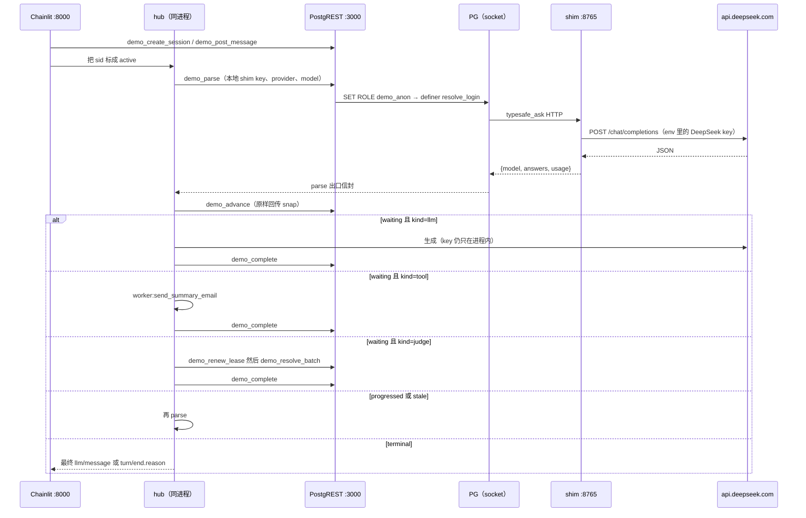

# v13 最小 agent 循环 demo（Chainlit + PostgREST）: Plan

## Goal

在 `v13/` 下新建一个**不上传 GitHub** 的本地 demo 目录，跑通一个最小 agent 执行循环：Chainlit 聊天前端 → PostgREST REST 面 → PG 里的 v13 状态机（`v13_parse`/`v13_advance`/claim→IO→complete），其中 LLM judgment 由进程内 DeepSeek 适配器（`DEEPSEEK_API_KEY` 环境变量）真实调用完成；uv 环境建在该目录内。

## Background

### v13 现状（重要修正：代码树并非归零）

- 09-21 的 revert 只针对核心 schema 首次落地（`eebbc37`），次日 `20cf491` 重新落地；此后 DP1–DP8 全部交付。当前 `v13/` 共 72 个 tracked 文件、14,470 行 SQL，14 个 stage 目录全部有货（schema/resolve/loop/twophase/envelope/manifest/chunks/recall/characterize/filter/memory/economy/summary/periphery），根级 `v13/__init__.py` + `v13/load.py`。无 `fakes.py`、无 demo/harness 目录。
- 执行环设计（`docs/designs/v13-context-on-pg.md` §4.3，`docs/plans/v13-dp1…dp8-*-2026-09-20.md`，教程 `docs/tutorials/v13/chapters/05-turn-and-advance.md`、`08-multi-language-harness.md`）：**不是 Python while 循环**——每 tick 一次幂等 SQL advance，两段事务：`v13_parse`（resolve 事务，无会话锁，`pg_advisory_xact_lock`）→ `v13_advance`（变更事务，`sessions FOR UPDATE`，毫秒级）。**环活在调用方，状态机活在库里**；三种调用方语义相同（worker settle 唤醒 / driver tick 扫描 / 人工手动）。queue（pgmq `v13_work`，core SQL 里 `SELECT pgmq.create('v13_work')` 创建）仅作唤醒、at-least-once；`pg_cron` 是清扫者不是节拍器。
- `v13_advance(p_sid uuid, p_snap jsonb) RETURNS text`（`v13/loop/advance.sql:197`，入参 = `v13_parse` 出口信封）→ 返回 `progressed | waiting | terminal | stale`。五步：① terminal/unresolved 处理 → ② `context_fresh` → ⑤ budget → ③ judge → ④ route；SQL fast-path reason `in_db_handler`。
- worker 契约（教程 ch08）：`v13_claim` → 进程内 IO → `v13_complete` + 控制订阅。`v13_claim` 在 `v13/schema/v13_core.sql:267`，`v13_complete` 在 `:300`；`v13_requeue_stale`/`v13_renew_lease` 在 `v13/twophase/v13_twophase.sql:33,78`。
- 状态词表：`sessions.status ∈ ready|waiting|blocked_unknown|completed|failed|cancelled`（`v13/schema/v13_core.sql:14`）；`effects.status ∈ ready|claimed|succeeded|failed|unknown|cancelled`；`decisions.status ∈ open|answered|cached|failed`。events 开放词表已含 `user/message, turn/route, turn/end, tool/result, llm/message, judge/answered, resolve/failed, effect_done, cancel/*`（`v13_core.sql:34-37`）——UI 时间线的天然素材。
- 设计过但**未落 SQL**：`v13_spawn_subsession`、`v13_visible_tools`（A17/E6）。
- judgment 链：`v13_parse`（`v13/resolve/v13_resolve.sql:661`，`v13/economy/v13_economy.sql:353` 重定义）；`v13_judgment_envelope` 经 resolve→envelope→manifest→recall→filter 链重定义。教程要求 `v13/fakes.py`（FakeJudge/FakeLLM/FakeTool，ch00/ch08）但未实现，现有测试用 `typesafe.mock_response` GUC mock（`v13/loop/test_loop.py:68`），gate `G-ctx1-5(b)` 断言 mock 仅出现在测试（`v13/twophase/test_twophase.py:143-147`）。
- 设计明确「dashboard = SQL 视图」（教程 ch15 `v_session_timeline`、ch13「dashboard（投影）| 视图 | 0 新组件」）；ch12 练习 3 提到「超 simple human UI：一条 psql 查询（待答 human effects）+ 一个函数调用（settle）」。**仓库无任何 Chainlit/PostgREST/FastAPI 先例**；前端先例只有 v6 Streamlit。v13.1 工作台平面计划（`docs/plans/v13.1-workbench-plane-plan-2026-09-21.md`）把 TS 前端推到后置可选项。

### ACL / 角色模型

- v13 已有三读角色 `v13_recall` / `v13_resolve` / `v13_route`，各 SQL 文件尾部按最小面 GRANT（例：`v13/economy/v13_economy.sql:1467-1477`、`v13/envelope/v13_envelope.sql:976-993`、`v13/chunks/v13_chunks.sql:1161`）。
- **部署面授权纪律**：跨 schema 的授权（如 stannum 引擎函数）写在各 stage `setup_db.py` 的 `GRANTS` 字符串里执行，不进 SQL 文件（`v13/characterize/setup_db.py:23-31,55`，R 组扫描断言封死 SQL 内授权）。demo 的角色/授权必须遵守同一纪律。
- 表建在 `public` schema（`v13_core.sql` 无 CREATE SCHEMA）；stannum 是引擎扩展 schema。

### DB / 服务器约定

- 连接唯一入口：根目录 `server.py` 的 `get_server()` → pgembed 0.3.0rc2，`PGDATA = <repo>/.pgdata`，**仅 unix socket 无 TCP**（`postmaster.opts` `-h "" -k .pgdata`），用户恒 `postgres`、空密码、动态端口；URI 形如 `postgresql://postgres:@/<db>?host=<socket_dir>`。PG 18.4。
- DB 命名 `agent_v13_<stage>`；`setup_db.py` 模式：`DROP DATABASE IF EXISTS ... WITH (FORCE)` → `CREATE DATABASE` → `load_stage`（可选 `probe_extension()` fail-closed、`GRANTS`、`run_probes()`）。
- SQL 注册：`v13/load.py:17-50` `SQL_LOAD_ORDER`（append-only 路径表）+ `STAGE_THROUGH`（stage → 前缀文件数）；`files_through(stage)`；`run_psql` shell 出 `psql -v ON_ERROR_STOP=1`；gate 跑法 `uv run python v13/<stage>/test_<name>.py`（根目录、退出码 0 = 通过、非 pytest）。

### DeepSeek 约定与 gate 纪律

- 真实 provider 适配器范本 `DeepSeekLLM`（`v8/loop/runtime.py:235-341`）：env `DEEPSEEK_API_KEY`（主）→ `OPENAI_API_KEY`（备）；base URL `OPENAI_API_URI` 默认 `https://api.deepseek.com/v1`；model `OPENAI_MODEL` 默认 `deepseek-chat`；raw urllib POST `/chat/completions`，receipt 记 `openai-compatible/chat.completions`；无凭据时开口前拒绝。
- gate 默认剥离凭据（`env -u DEEPSEEK_API_KEY -u OPENAI_API_KEY -u OPENAI_API_URI -u UV_ENV_FILE` + `UV_NO_ENV_FILE=1`，`docs/plans/v8-j0-keyless-baseline-report-plan-2026-09-17.md:258,355`）；真实 provider 冒烟采用 opt-in 模式（`v8/compat/test_compat.py:1133-1170`：`--real-provider-smoke` 才构造 adapter，缺凭据 → `not_run` + exit 2）。
- AGENTS.md 不变量 4：外部 IO 一律不进数据库事务；测试用 FakeLLM/FakeTool，不调真实 provider。

### uv / pyproject / gitignore

- 仓库**唯一** `pyproject.toml` + `uv.lock` 在根（`requires-python >=3.12`，`.python-version`=3.12，uv 0.8.24）；依赖 litellm、`pgembed>=0.3.0rc1`（**本地 editable `[tool.uv.sources]` 指向 `../pgembed`**）、psycopg2-binary、duckdb（本地 wheel）、streamlit；`[tool.uv] prerelease="allow"`。
- `.gitignore`：`.venv`（无斜杠，**匹配任意深度**）、`.pgdata/`、`prompt-exports/`、`/memory`、`.DS_Store`、`.spike-flock/`。v13 目录内嵌套 `.venv` 已被忽略；但 demo 源码本身要「不上传 GitHub」需**显式新增条目**（如 `/v13/demo/`）。
- v6 前端先例（`v6/workbench_demo/app.py`，821 行，Streamlit）：`@st.cache_resource` 持 psycopg2 连接；后台 daemon 线程跑 `AgentWorker.pump_once()` 轮询（0.15s）；结果经 `st.session_state` 回主线程。LLM 配置从进程 env 读（`DEEPSEEK_API_KEY`/`OPENAI_API_URI`/`OPENAI_MODEL`），demo 不注入配置。

### Chainlit（外部调研，2026-09-23 核实）

- 版本 **2.12.0**（2026-08-25 发布；社区维护状态——原团队 2025-05 退出，`@Chainlit/chainlit-maintainers` 接手）。Python `>=3.10,<3.14`（根 3.12 兼容）。
- 最小形态：`@cl.on_message async def main(message: cl.Message)`；`chainlit run app.py -w`；默认端口 **8000**（websocket UI）。`--headless` 不开浏览器；测试配方 `if __name__ == "__main__": from chainlit.cli import run_chainlit; run_chainlit(__file__)`。
- 流式：`msg = await cl.Message(content="").send()` → `await msg.stream_token(tok)`；步骤 `@cl.step(type="tool"/"llm")`（自动嵌套、可 `cl.context.current_step.stream_token`）。
- 阻塞调用必须 `cl.make_async(fn)()` 或 async 客户端；取消是协作式（`@cl.on_stop` 置 flag，循环自查）。生命周期钩子 `on_chat_start/on_message/on_stop/on_chat_end`。本地开发**无需 auth**（默认 public）；数据持久化层可选（PG+asyncpg Prisma，社区层 schema 陈旧——demo 不需要）。

### PostgREST（外部调研，2026-09-23 核实）

- 版本 **v16.3**（2026-09-11）；要求 **PG ≥ 14**（PG 18.4 兼容）；维护线 v14.18。默认端口 **3000**。
- 最小配置：`db-uri`（`PGRST_DB_URI`，**不可热重载**，支持 libpq 全形态：URI/keyword-value/PG 环境变量/`@file`）、`db-schemas`（默认 `public`）、`db-anon-role`（未设且无 `jwt-secret` 则拒绝服务）。
- **unix socket 连接官方支持**：「omit the host and the password, e.g. `postgres://user@/dbname`」+ libpq `PGHOST` 指向 socket 目录——正好匹配 pgembed 无 TCP 环境。
- 角色模型：连接角色 = `authenticator`（LOGIN NOINHERIT）每请求 `SET LOCAL ROLE`；需 `GRANT <anon_role> TO authenticator` + schema USAGE/表授权。本地匿名 demo 免 JWT。
- 函数经 `POST /rpc/<name>` 暴露（GET 仅非修改性）；**不支持存储过程、无流式**（token 流必须在 Chainlit 进程内做）；连接池默认 `db-pool=10`。
- DDL 后 schema cache 需重载（`NOTIFY pgrst, 'reload schema'` 或 SIGUSR2）——demo 建库一次成型，运行期无 DDL 则不触发。
- macOS：`brew install postgrest`（静态二进制需 libpq）；Docker Desktop 的 `--net=host` 在 macOS 不可用——本 demo 直接用本机二进制连 socket。
- CORS 默认开放；Chainlit(:8000) 与 PostgREST(:3000) 两进程两端口，互不共享。

### 组合事实

- Chainlit+PostgREST **无官方集成配方**（GitHub 0 结果）；可行模式 = Chainlit 后端进程用 httpx 调 PostgREST REST 面（或 PyPI `postgrest` 2.31.0 客户端，注意其上游仓库已并入 supabase-py monorepo）。
- 同步 requests/psycopg 在 handler 里会阻塞事件循环——demo 统一 async httpx。

## 摘要

DP1–DP8 的状态机已经在库里，缺的是库外那一圈调用方。本方案在 `v13/demo/` 加一个不进 Git 的本地适配层：Chainlit 只负责会话 UI，PostgREST 只暴露 demo 自有的 `SECURITY DEFINER` RPC 和只读视图，进程内一个 hub 按「`v13_parse` 事务 → `v13_advance` 事务 → 若 `waiting` 则 `v13_claim` → 进程内 IO → `v13_complete`」拨格。判断 IO 走 **J-A**：`typesafe.endpoint` 指向本机 shim，把 systemone 批请求译成一次 DeepSeek `/chat/completions`，再把答案译回 `typesafe_ask` 的返回形状；生成 IO 走另一条进程内 DeepSeek 调用，语义对齐 `v8/loop/runtime.py` 的 `DeepSeekLLM`。库加载停在 **`envelope`（stage 5）**，不进 characterize / economy / recall。这是适配，不是重构：v13 函数体、`SQL_LOAD_ORDER`、根 `pyproject.toml` 都不动。

相对探索脚手架（本文件 Open Questions 已全部由「设计→决策」表关闭）的两处修正：**加载停在 `envelope` 而非 periphery 全量**（characterize 的 stannum 硬依赖、economy 花费闸、recall 语料都会改变要演示的行为，见「现状分析→加载阶段」）；**judge 慢路必做而非可选**（省略会在目录变大时把会话推向「烧放弃预算 / 误路由 / 楔死」三选一，见「现状分析→判断的唯一写入点」，以 `remaining=0` tripwire 断言默认不走）。

## 执行索引

| # | 工作项 | Goal | Done when | Key files | Deps | Size |
|---|---|---|---|---|---|---|
| W0 | 可装性探针（uv 项目） | chainlit 2.12.0 + pgembed 装得进独立环境 | `uv run --project v13/demo python -c "import pgembed, chainlit, httpx, psycopg2"` 通过 | `v13/demo/pyproject.toml` | — | XS |
| W1 | 唯一 tracked 提交 | gitignore + 计划落库 | `git push origin main` 成功；`git status` 无 `v13/demo/` 文件 | `.gitignore`、本文件 | W0 | XS |
| W3 | 建库 build() | 建出 demo 库 + typesafe.provider 注册探针 | 打印 `[ready] agent_v13_demo` 与 socket 目录、`current_setting('typesafe.provider')` 断言绿 | `settings.py`、`setup_db.py`、`sql/demo_api.sql` 骨架 | W0 | M |
| W4 | RPC + 视图补全 | demo_* 函数（默认 9 个；pre_request 族可选 +2）+ 3 视图 + 授权自检 | postgres 直调 create/post_message 成功；权限断言（测试 10）绿 | `sql/demo_api.sql` | W3 | M |
| W5 | driver + fake gate | 端口协议 + fakes + hub + 主 gate | 剥凭据命令退出码 0；断言 1（remaining=0 tripwire）先绿 | `contract.py`、`port_pg.py`、`fakes.py`、`driver.py`、`harness.py`、`test_demo_loop.py` | W4 | L |
| W6 | judge 慢路用例 | 慢路代码被测试覆盖 | 临时撑爆目录的用例证明 judge effect 被 `demo_resolve_batch` 消化 | `test_demo_loop.py`（用例后清理） | W5 | S |
| W7 | deepseek.py 单测 | 生成适配器（假传输，不联网） | 无 key 拒绝 + receipt 协议串断言绿 | `deepseek.py` | W0 | S |
| W8 | shim 翻译层 | 线格式已由评审定案（`typesafe_last_request()`），实现翻译层 | `test_demo_shim.py` 绿（mock 库对拍） | `shim.py`、`test_demo_shim.py` | W3、W7 | M |
| W9 | 冒烟 gate | opt-in 真实 DeepSeek 冒烟 | 无 flag exit 0；有 flag 无 key exit 2；三子用例失败 exit 1 | `test_demo_smoke.py` | W5、W8 | S |
| W10 | REST 端口 + Chainlit + 手册 | 前端全链路 | 人工清单 6 项全过 | `port_rest.py`、`app.py`、`README.md` | W5、W8、W9 | M |

## 现状分析

### 环在调用方，状态在库里

一次拨格是两笔独立事务。`v13_parse(sid)` 不拿 `sessions` 行锁，只在有缺口时 `pg_advisory_xact_lock`；`v13_advance(sid, snap)` 持 `sessions FOR UPDATE`，返回 `progressed | waiting | terminal | stale`（`v13/loop/advance.sql` 中 `v13_advance` 的入口锁与四值返回；教程 `docs/tutorials/v13/chapters/05-turn-and-advance.md` 第 5.1–5.2 节）。`stale` 只表示同一 session 的探针七键过期，调用方重 parse；sid 不一致是 `RAISE`，不是 `stale`（`v13/loop/advance.sql` 入口三重 sid 校验，M3-17 所测路径，测试在 `v13/loop/test_loop.py` 的 M3-17 段）。

`v13_route` 的优先级是固定的（`v13/loop/advance.sql:110-163`）：本 turn、`origin_user_seq = last_user_seq` 的 `llm/message` → `finish`（reason `answered`；P0 只认锚定的 `llm/message`，`tool/result` 不终结——M3-6）；其后 `gate_off_topic reject` → `reject`（reason `injection_veto`）；intent 低置信 → `human`（`low_intent_confidence`）；`model_escalate` → `human`；`sql_answer|tool_action` 且双 gate pass 且 tool ≠ none → sql 快路（`in_db_handler`，同事务执行 handler）/ `risk_veto` → human / `side_effect_tool` → tool effect；目录未收录或 disabled → `tool_unavailable` → human；其余 → `llm`（`generation_needed`）。sql 快路在变更事务内执行 handler 并直接把 effect 写成终态，不经队列（`v13/loop/README.md:7-8`）。tool / llm / human 才 `v13_enqueue_effect` + `v13_send_work`。`v13_claim` 扫的是 `effects.status = 'ready'`，不是 pgmq（`v13/schema/v13_core.sql:267` 附近 `v13_claim`）。推论：demo 不必读 `v13_work`；队列消息可丢，认领以账本为准。

### 用户消息没有 ingress 函数

起一个 turn 的现成手法是两句：`INSERT INTO sessions`，再 `v13_append_event(..., 'user/message', {"text": ...})`（`v13/loop/test_loop.py:53-60`）。`v13_append_event` 在行锁里分配 `seq`，`user/message` 时 `turn_no + 1`，并把 `completed|failed` 复位成 `ready`；`cancelled` 不复位（`v13/schema/v13_core.sql:66-99`）。`events` 上的 append-only 触发器拒绝绕过该函数的 UPDATE/DELETE。`EXECUTE v13_append_event` 只在 `v13_route`（`v13/schema/v13_core.sql:878-892` 授权块）。`INSERT` on `sessions` 没有授给三角色（core ACL 块只授 sessions 的 SELECT 给三角色、UPDATE 给 `v13_route`），现有测试是用超级用户连接插的（`test_loop.py` 的连接来自 `server.get_uri`，用户是 `postgres`）。推论：demo 必须自有 RPC 包装这两步，并在部署面补 `GRANT INSERT ON sessions TO v13_route`，不能改 `v13_core.sql`。

### 判断的唯一写入点是 `v13_resolve_judgments`

没有「列出 open decisions」的 API。缺口是 `v13_gap(env)` 相对 `v13_needed_judgments` 的派生量（`v13/resolve/v13_resolve.sql` 中 `v13_gap`、`v13_needed_judgments`）。答案只由 `v13_resolve_judgments` 在事务里 `typesafe_ask` → `v13_validate_answer` → `INSERT decisions` 写下（同文件 DP1 版；`v13/envelope/v13_envelope.sql` 换体后另写 `judgment_calls` / `judgment_cache`）。`v13_complete` 对 judge 成功只落 `effect_done`，失败才追加 `resolve/failed`（`v13/schema/v13_core.sql:381-392`）。开放词表（`v13_core.sql:34-37`）里的 `judge/answered` 没有写入器（`v13_complete` 的事件分支不产生它）。UI 不能等这个类型。

种子目录是 `session_stats`（sql，空 `param_spec`）和 `send_summary_email`（tool，`tone` + `audience`）（`v13/schema/v13_core.sql:932-956`）。needed 因此是 5 个固定信号 + 4 个 param/stated = 9。`resolve_fast_path.batch_questions = 32` 且 `max_batches = 1`（`v13_policies` 种子）。推论：默认目录下一次 parse 的快路能把缺口问完，`remaining = 0`，judge effect 不会出现。这是断言，不是假设——gate 里要有 tripwire。

即便如此，慢路仍要做出来。`remaining > 0` 时 advance ③ 会挂 judge effect 并返回 `waiting`；该 effect 在 `ready|claimed` 时步骤 ① 挡住后续一切推进（`v13/loop/advance.sql` 步骤 ① 与 ③）。把它 `complete failed` 会写 `resolve/failed`，而 `v13_parse` 在本 turn 这类事件达到 `resolve_retry.cap = 2` 时直接 `abandon`（`v13/schema/v13_core.sql:381-392` 与 `v13/resolve/v13_resolve.sql` 的 `v13_parse`）。把它 `complete succeeded` 会掉进路由，缺口仍在。放着不结算则会话楔死。推论：省略慢路在种子目录上碰巧安全，一但目录变大就只有「烧放弃预算 / 误路由 / 楔死」三条。慢路就是再调一次已经存在的 `v13_resolve_judgments(effect.request.envelope, 1)`，envelope 投影故意留下 `budget` / `templates` / `groups` / `needed`（`v13/envelope/v13_envelope.sql` 的 `v13_effect_envelope` 只剥水位、策略、目录、`candidate_generation_revision`）。这不是第二套判断管线。

### `v13_claim` / `v13_complete` 的合同

`v13_claim(worker, lease_ms)` 返回 `{effect_id, attempt_no, fence, kind, request}`，不带 `idempotency_key` 和 `session_id`（`v13/schema/v13_core.sql:267` 附近 `RETURNING`）。它全局领最早的 ready 行，不按 session 过滤（此谓词的正确性依赖 `op_seq IS NULL` 恒真——`v13_core.sql:116`「并行序留缝(ch8)，DP1 恒 NULL」，全树无写入点；claim 谓词第二臂 `op_seq = (SELECT min(op_seq)...)` 在 `v13_core.sql:289-292`，「加载停在 envelope」正是无意中保护这条谓词的前提。另：`ux_v13_effects_single_active`（`v13_core.sql:128-129`，每 session 至多一行 `ready|claimed`，DDL 执法）是 hub 单认领者模型与 judge 慢路「一个活跃 effect」推理的硬前提）。`v13_complete` 要求非空 `(attempt, fence)`，状态必须已是 `claimed`，令牌用 `IS DISTINCT FROM`；llm 成功的 `result.text` 必须是非空字符串，否则降级为 `failed` 且 `error.code = llm_result_shape`，不落 `llm/message`（同文件 `v13_complete`）。tool 成功落 `tool/result`，llm 成功落 `llm/message`，两者 payload 都由 SQL 写入 `origin_user_seq`。返回 `accepted | stale | replay`。

`v13_requeue_stale`：过期 judge 在 cap 内回到 `ready`（只加 `fence`）；过期且超 cap 的 judge 变成 `failed`；**其余 kind 过期变成 `unknown`**（`v13/twophase/v13_twophase.sql:33` 起 `(a1)/(a1')/(a2)`）。`unknown` 被 advance ① 当成墙，而 ch12 的显式 resolve 没有落地（`v13_core.sql:14-18` 对 `blocked_unknown` 的预留注释）。`v13_complete` 不看 `lease_until`，只看令牌和 `claimed`。推论：进程重启后，必须先用行上的 `attempt_no/fence` 把本 worker 的 tool/llm/human claim 结算成 `failed`，然后再 `v13_requeue_stale`；顺序反了就会把可结算的行收成永久的 `unknown`。

### 加载阶段：原「stage = loop」是错的

`files_through(stage)` 取 `SQL_LOAD_ORDER[:STAGE_THROUGH[stage]]`（`v13/load.py:53-55`）。`loop = 3` 只有 core + resolve + `advance.sql`；`twophase = 4` 才有 `v13_requeue_stale` / `v13_renew_lease`；`envelope = 5` 才换上带 `judgment_calls` / `judgment_cache` / `v13_guc_required` 的判断平面（`v13/load.py:17-50`，`v13/envelope/v13_envelope.sql` 对 `v13_resolve_judgments`、`v13_judgment_envelope` 的替换）。`v13/loop/setup_db.py` 的库确实不包含 twophase（`v13/loop/setup_db.py` 的 `STAGE = "loop"` 与 `v13/loop/README.md:5`）。

`envelope` 不替换 `v13_parse` 的函数体。DP1 的 `v13_parse` 仍调用名字 `v13_judgment_envelope` / `v13_resolve_judgments`，加载到 envelope 之后这两个名字指向 DP2 实现。DP2 的返回仍含 `asked_questions`、`asked_batches`、`remaining`、`failed`（两版 `v13_resolve_judgments` 的 `jsonb_build_object`）。推论：demo 库加载到 envelope 时，parse 的控制流仍是 DP1，判断落账是 DP2。这是加载序的既定组合，不要去「修正」`v13_parse`。

再往上会改变要演示的行为，所以停在 envelope：

- characterize 起，`setup_db.py` 对 stannum 扩展 fail-closed（`v13/characterize/setup_db.py:33-45`）。
- economy 替换 `v13_parse`，超花费闸就跳过 resolve、把缺口推给慢路（`v13/economy/v13_economy.sql:353-395`）。
- recall 再替换 `v13_judgment_envelope`，把语料并进 ctx（`v13/recall/v13_recall.sql:486` 起）。manifest / chunks 是这条替换的前置文件，一并排除。

### DeepSeek 接不进 `typesafe.endpoint`

`typesafe_ask` 走 systemone 线，已打通的对端是 OpenRouter `/api/alpha/decisions`；GUC 是 `endpoint` / `api_key` / `model` / `timeout_ms` / `mock_response` 等（`v12/indb/README.md:8-12` 与 OpenRouter 配置段）。DeepSeek 是 OpenAI-compatible `POST /chat/completions`（`v8/loop/runtime.py:235-341` 的 URL、模型默认值、`stream: False`、无 key 则开口前拒绝）。推论：把 `typesafe.endpoint` 指到 `api.deepseek.com` 不会得到 `v13_validate_answer` 能接受的 `answers` 对象。mock 注入的形状才是 SQL 看到的返回：`{model, answers: {signal: choice|score|noul}, usage}`（`v13/loop/test_loop.py:66-67`、`mock_from_needed` 约 118-134 行，以及 `v13/resolve/v13_resolve.sql` 的 `v13_validate_answer`）。

DP2 的 `v13_judgment_envelope` 用 `v13_guc_required('typesafe.provider')` 和 `typesafe.model`，缺了就 `V3002`（`v13/envelope/v13_envelope.sql` 中 `v13_guc_required` 与 envelope 的 runtime CTE）。`v12/indb/README.md` 的 GUC 清单没有 `typesafe.provider`。`current_setting(name, true)` 对从未设置的自定义项返回 NULL，随后被 `v13_guc_required` 拒绝。两段式自定义 GUC 占位在保留前缀上**不生效**：`typesafe` 前缀被 pg_typesafe 保留而 `provider` 未注册，`set_config(..., true)` 静默无效（`current_setting` 读回空串）——2026-09-23 评审实机核正。修法是 `build()` 里一行 `ALTER DATABASE {db} SET typesafe.provider`（部署面注册，不改 v13 SQL），注册后 per-txn `set_config` 覆盖生效；退路已删除（见 D10）。

本仓库的 pg_typesafe HTTP 等待不被 `statement_timeout` / `pg_cancel_backend` 打断，#45(b) 的 V3001 回退是激活状态（`v13/resolve/setup_db.py` 的 `probe_timeout` 注释；`v13/loop/README.md` 台账指向 resolve README 的 #45(b)）。推论：parse 路径不能靠 5 秒的 `statement_timeout` 去切断 DeepSeek；截止时间要放在 shim 和 `typesafe.timeout_ms` 上。advance 的 250ms/5s 是另一条连接、另一笔事务的纪律（`v13/loop/README.md:17`；`advance.sql` 写明函数体内 `set_config` 罩不住嵌套 handler，护栏在调用方）。

### 角色

`v13_recall` / `v13_resolve` / `v13_route` 都是 `NOLOGIN`。`v13_resolve_login` 只入 resolve，`v13_route_login` 只入 route，双方 `SET ROLE` 到对面会被数据库拒绝（`v13/schema/v13_core.sql:814-848`；`v13/loop/test_loop.py` M3-12；`v13/loop/README.md:16`）。`v13_parse` 的 EXECUTE 只给 resolve，`v13_advance` 只给 route。登录角色默认 INHERIT，所以属主是 `v13_resolve_login` 的 `SECURITY DEFINER` 函数拥有 resolve 的权限，且仍然没有 advance 的权限。

部署面授权的先例是写在 `setup_db.py` 的 `GRANTS` 字符串里执行，不写进被 R 组扫描的 stage SQL（`v13/characterize/setup_db.py:23-31`）。demo 照这个做，并且 **不** 把 demo SQL 追加进 `v13/load.py` 的 `SQL_LOAD_ORDER`。

### 服务器与忽略规则

连接只有 unix socket，用户 `postgres`、trust、动态端口，`PGDATA = <repo>/.pgdata`（`server.py:12-21`）。`.gitignore` 的 `.venv` 无斜杠，任意深度的虚拟环境已被忽略（`.gitignore:10`）。`/v13/demo/` 目前没有条目，demo 源码仍会被 `git add` 跟踪。根 `pyproject.toml` 的 `pgembed` 是 `../pgembed` 的 editable 源（`pyproject.toml:15-19`）。从 `v13/demo/` 看，同一目录是 `../../../pgembed`。

### 可复用与不要复用

| 复用 | 不复用 |
|---|---|
| `get_server` + `load_stage` + `run_psql` + `v13.resolve.setup_db.run_probes` | 根 `pyproject.toml` 的依赖集合（不含 Chainlit，也不该为 demo 修改它） |
| `v13_append_event` / `v13_parse` / `v13_advance` / `v13_claim` / `v13_complete` / `v13_renew_lease` / `v13_requeue_stale` / `v13_resolve_judgments` | `v13_claim` 的全局谓词（demo 用包装补列，不改函数） |
| `DeepSeekLLM` 的 env 名、URL、receipt 协议串、无 key 拒绝（`v8/loop/runtime.py:235-341`） | v8 的 `unknown_outcome` 结算语义（见偏差 D4） |
| `test_compat.py` 的 `--real-provider-smoke` / 缺凭据 exit 2（约 1133-1170 行） | 把 Fake 放进 `v13/fakes.py`（该文件不存在，教程要它，但本任务禁止为 demo 改跟踪树） |
| `test_loop.py` 的 `check()` + 退出码 0，以及 `connect_as` 解析 socket `host` 的方式 | v6 Streamlit 的 daemon 线程 + `session_state`（Chainlit 是 async；后台线程碰 UI 上下文是错的模型） |

## 设计

### 决策（关闭原 Open Questions）

| 原问题 | 决定 |
|---|---|
| postrest 是什么 | PostgREST。Chainlit 进程用 httpx 调 `POST /rpc/<name>`，浏览器只连 Chainlit。 |
| 用户消息 seam | `demo_create_session` + `demo_post_message` → `INSERT sessions` + `v13_append_event`。payload 只有 `{"text": ...}`，不接受客户端 jsonb。 |
| judgment seam | 快路：`demo_parse` → `v13_parse`。慢路：claim 到 `kind=judge` 时，用 effect 里冻结的 envelope 调 `demo_resolve_batch` → `v13_resolve_judgments(env, 1)`，清空后 `complete succeeded`。不读 open decisions，不期望 `judge/answered`。 |
| 判断走 DeepSeek 的方式 | **J-A shim**。DeepSeek key 只活在 Chainlit/shim 进程的环境变量里。PG 的 `typesafe.api_key` 是进程启动时生成的本地共享秘密，不是 DeepSeek key。 |
| J-B 预填 decisions | 不实现。评审已实机确认线格式是 JSON（`typesafe_last_request()` 取样），J-B 的停工条件不存在。 |
| RPC 属主 | **双属主**。parse / resolve_batch 属主 `v13_resolve_login`；建账与消息属主 `v13_route_login`。单属主（postgres）会让一个写错的 RPC 同时拿到两相权限，M3-12 的隔离就没了。 |
| 加载到哪 | **`envelope`**。库名交互用 `agent_v13_demo`，gate 用 `agent_v13_demo_test`，同一 `build()`。 |
| 最小行为边界 | 多轮要有。工具 effect 用种子 `send_summary_email`，进程内假发送，不发 SMTP。`session_stats` 走 sql 快路，不写 Python handler。判断与生成都不做 token 流。human effect 不做人答 UI：聊天里展示 `reason`，随即 `complete succeeded`，让 `turn_budget` 能把回合收进 `terminal`。取消 = 停 hub 并 fail-settle 在手 claim，不写 `cancel/*`。不做 subsession。 |
| judge 慢路 | **要做**（见现状里的预算交互）。种子目录的 tripwire 断言它不被走到。 |
| uv | `v13/demo/pyproject.toml` 独立环境，`pgembed` path = `../../../pgembed`，`prerelease = "allow"`，`requires-python >= 3.12`。 |
| gitignore | 在跟踪提交里加一行 `/v13/demo/`。与计划文档同一次提交，只含这两个路径。 |

### 组件与数据流



每个 RPC 是 PostgREST 的一笔事务，因此 parse 与 advance 天然拆开。测试用的 psycopg 端口必须在每次调用后 `COMMIT`（或等价地一调用一事务），禁止在同一事务里先 parse 再 advance。

hub 是进程内唯一的认领者。`v13_claim` 全局领单，所以 Chainlit 的 `on_message` **不**调用 claim。它只 `demo_post_message`，把 `sid` 放进 active 集合，然后从该 sid 的 `asyncio.Queue` 取时间线事件，直到 terminal 或 error。UI 写入只发生在持有 Chainlit context 的 `on_message` 里。同一 sid 已有在飞 tick 时，新消息直接回「上一回合还在执行」，不入队（对齐 v6 聊天页「单 run 在飞则拒绝」的产品行为，实现不用线程）。

多会话在一个 hub 协程里串行。这是单操作者 demo 的吞吐边界，不是漏做的锁。

### 行为边界与回合怎么走完

用户文本：`btrim` 后非空，长度 ≤ 8000，超出由 `demo_post_message` `RAISE`。Chainlit 已展示的用户气泡不再用事件重复画。

Fake 与真实共用一个 driver。差异只在注入物：

- `answer_mock(sid, events) -> str | None`：返回 JSON 字符串则 `demo_parse(..., p_mock=该串)`；返回 `None` 则 `p_mock` SQL NULL，走 shim。
- `generate(messages) -> {text, model, usage} | failure`
- `tools["worker:send_summary_email"]`

种子目录、真实模型、一次普通聊天的预期拨格（`v13_policies` 种子：`turn_budget.max_cycles = 3`；finish 也会先写一条 `turn/route` 再写 `turn/end`，advance ④ 在 `CASE` 之前 append route）：

| 路径 | 拨格 |
|---|---|
| 纯生成 | route=llm（cycle 1）→ complete → route=finish（cycle 2）→ `completed` |
| sql 快路或 tool | route=sql\|tool（cycle 1）→ 再判断 → route=llm（cycle 2）→ complete → finish（cycle 3） |
| 低置信 / 升级 / 风险否决 | 每次 human route 占一个 cycle；hub 展示 reason 并 `complete succeeded`；cycle 满 3 后走 `budget_exhausted` human；再 ack 一次，下一次 advance 命中「human 已 succeeded」分支，写 `turn/end delivered=false`，`sessions.status=failed`，返回 `terminal`（advance ⑤ 的 succeeded 重放分支） |

所以 human 的「停」发生在 `terminal`，不是把 effect 留在 `ready`。留在 `ready|claimed` 时，下一条 `user/message` 复位不了 `waiting`，advance ① 会永远 `waiting`（append 只复位 `completed|failed`；advance ① 的未决集合含 `ready` 与 `claimed`）。

`on_stop`：置该 sid 的取消标记。hub 在每次 RPC 之间查看。parse 已发出则允许那一笔完成（判断费可能已经发生），然后不再 advance；若已经 advance 且手握 claim，对非 judge 行 `complete failed`，`result = {"code":"demo_cancelled"}`，不做外部 IO。不追加 `cancel/*`。取消后 session 上没有未决 effect，下一条用户消息可以继续：`waiting` 不在终态集合里，新的 parse 使用新水位（advance ① 只把 `completed|failed|cancelled` 当 `terminal`）。（粒度注：hub 串行多会话，取消标记只在 RPC 之间查看——别的会话 60s 生成在飞时会延迟本会话取消生效；标记在 tick 结束时清除，新 tick 不继承。）

llm 传输失败、空文本、未知 handler：`complete` 用 `failed`，`result.code` 分别为 `demo_llm_transport`、`demo_llm_empty`、`demo_unknown_handler`。不用 `unknown`。空文本若以 `succeeded` 送入，会被 SQL 降级成 `llm_result_shape` 且不落 `llm/message`（`v13_complete` 的形状校验）——driver 仍应自己挡掉空白，避免多一次无意义的成功尝试。失败的 llm effect 不是未决行，下一拨格会新开 cycle、新 effect id（身份含 `v13_cycle_no`），直到预算 human。一次超时最多产生一次外部调用。

`stale`：丢弃这份 snap，下一轮重新 parse，不建 effect（M3-8）。snap 必须原样回传，driver 不改字段、不重算哈希。httpx 的 JSON 数字往返对 `->>` 文本比较是稳定的（整数仍是整数）；禁止把 snap 转成浮点。

tick 上限 16。耗尽则若手握非 judge claim 就 fail-settle，UI 显示 tick cap，sid 离开 active。

### 库、角色、RPC

`build(db_name)` 的顺序：

1. `get_server()`；DROP 前先探测 `pg_stat_activity` 中 `agent_v13_demo*` 库的非本会话连接（PostgREST 池还活着则响亮失败并提示先停 PostgREST——这是 D14 的前置执法），然后 `DROP DATABASE IF EXISTS {db} WITH (FORCE)`、`CREATE DATABASE`。
2. `load_stage(server, db, "envelope")`。
3. `run_probes`（typesafe ACL、不可达端点、超时可交付性）。探针里的挂起 socket 可能让 setup 多等约 5 秒，这是既有 `probe_timeout` 的行为，不要改。
4. 注册并断言 `typesafe.provider`：`run_psql("postgres", "ALTER DATABASE {db} SET typesafe.provider = 'deepseek';")`，随后新连接 `current_setting('typesafe.provider')` 读回 `deepseek` 作断言，失败退出码 1（评审实机验证此修法可行；per-txn `set_config` 注册后才生效）。
5. `run_psql` demo SQL（对象 + `REVOKE PUBLIC`，不含 GRANT）。
6. 部署面 `GRANTS` 字符串。
7. 属主与 `prosecdef` 自检，失败则非 0 退出。

demo SQL **不** `CREATE EXTENSION`、不 `CREATE OR REPLACE` 任何 `v13_*`、不 `INSERT` 工具或策略。

角色（只在 `GRANTS` 字符串 / setup 的 `run_psql` 里，用 `IF NOT EXISTS` 语义，重复 build 可重入）：

- `authenticator`：`LOGIN NOINHERIT`，无密码。pgembed 本地 trust 才能连上。
- `demo_anon`：`NOLOGIN`。
- `GRANT demo_anon TO authenticator`。
- authenticator **不**加入 `v13_resolve` / `v13_route`。

函数（全部 `LANGUAGE plpgsql`，`SECURITY DEFINER` 者 `SET search_path = public`）：

| 函数 | 属主 | 作用 |
|---|---|---|
| `demo_create_session() RETURNS uuid` | `v13_route_login` | `INSERT INTO sessions DEFAULT VALUES RETURNING session_id`。默认策略 `('default',1)` 已在 core 里冻结，触发器放行。 |
| `demo_post_message(p_sid uuid, p_text text) RETURNS bigint` | `v13_route_login` | 空白或长度 > 8000 则 `RAISE`。`v13_append_event(p_sid, gen_random_uuid(), 'user/message', jsonb_build_object('text', btrim(p_text)))`。 |
| `demo_parse(p_sid uuid, p_provider text, p_model text, p_endpoint text, p_shim_key text, p_timeout_ms int, p_mock text) RETURNS jsonb` | `v13_resolve_login` | 见下方 GUC 顺序，然后 `RETURN v13_parse(p_sid)`。 |
| `demo_resolve_batch(p_env jsonb, p_provider text, p_model text, p_endpoint text, p_shim_key text, p_timeout_ms int, p_max_batches int) RETURNS jsonb` | `v13_resolve_login` | 同样的 GUC 顺序（慢路的实际 HTTP 超时取自冻结信封的 `envelope.timeout_ms`——`v13_resolve_judgments` 调 `typesafe_ask` 前会 `SET LOCAL` 覆盖 GUC，`v13/envelope/v13_envelope.sql` ~719-721；`p_timeout_ms` 只在信封 `timeout_ms` 为 NULL 时生效。`decisions`/`judgment_calls` 的 provider/model 同样取冻结信封，不是 GUC），`p_mock` 固定清掉，`RETURN v13_resolve_judgments(p_env, p_max_batches)`。`p_max_batches` 由 driver 传 1。 |
| `demo_advance(p_sid uuid, p_snap jsonb) RETURNS text` | `v13_route_login` | 只 `RETURN v13_advance(p_sid, p_snap)`。超时不在函数体内设。 |
| `demo_claim(p_worker text, p_lease_ms int) RETURNS jsonb` | `v13_route_login` | 调 `v13_claim`。无行则返回 SQL NULL。有行则把 `idempotency_key`、`session_id`、`tool_name` 并进返回对象。不复制 claim 的 `SKIP LOCKED` 谓词。 |
| `demo_complete(p_effect uuid, p_attempt int, p_fence bigint, p_status text, p_result jsonb) RETURNS text` | `v13_route_login` | 转发 `v13_complete`。 |
| `demo_renew_lease(p_effect uuid, p_fence bigint, p_ms int) RETURNS boolean` | `v13_route_login` | 转发 `v13_renew_lease`。 |
| `demo_requeue_stale() RETURNS jsonb` | `v13_route_login` | 转发。只在 hub 启动时调用。 |
| `demo_apply_timeouts(p_path text) RETURNS void` | invoker，非 definer | 【可选，默认不做】按路径 `set_config` 本地超时。 |
| `demo_pre_request() RETURNS void` | invoker | 【可选，默认不做】`current_setting('request.path', true)` 传给 `demo_apply_timeouts`（PostgREST `db-pre-request` 钩子）。 |

`demo_parse` / `demo_resolve_batch` 的 GUC 顺序（前提：`typesafe.provider` 已由 `build()` 的 `ALTER DATABASE ... SET` 注册为数据库级 GUC——见上；`typesafe.c` 的 `_PG_init` 只注册 `api_key`/`endpoint`/`model`/`timeout_ms`/`mock_response`/`batch_size`/`http_concurrency`，对保留前缀里未注册的名，`set_config(..., true)` 静默无效）：

1. `typesafe.mock_response` 先置 NULL（清掉池化连接上的会话级残留；`set_config` 的 NULL 值会把该项复位到默认）。
2. `typesafe.provider` = `p_provider`，`typesafe.model` = `p_model`。两者空白则 `RAISE`（实机核正：`typesafe.model` 扩展默认是**空串**，不设必 V3002——这一步不能省），让错误出在 demo 边界而不是包一层 `V3002`。
3. 若 `p_mock` 非 NULL：写入 `typesafe.mock_response`；`typesafe.endpoint` 设为 `http://127.0.0.1:9/disabled`，避免 mock 失效时打到真 API。
4. 若 `p_mock` 为 NULL：`typesafe.endpoint` = `p_endpoint`，`typesafe.api_key` = `p_shim_key`，`typesafe.timeout_ms` = `p_timeout_ms` 的十进制文本。

provider/model 的取值来自进程启动时冻结的 `Settings`，中途不改。fake 模式用 `provider=fake`、`model=fake-judge`，与真实的 `deepseek` / `deepseek-chat` 哈希空间分开，避免 mock 答案被真实回合命中。DP2 的 `judgment_cache` 主键是全局 `request_hash`（`v13/envelope/v13_envelope.sql` 的 `judgment_cache`），跨 session 复用是 DP2 的行为，demo 不要「修掉」。

视图（属主 postgres，默认 invoker 关闭，即按属主权限读基表；`demo_anon` 只拿视图的 SELECT，不拿基表权限）：

- `demo_session_head(session_id, status, turn_no, next_seq)`
- `demo_session_timeline(session_id, seq, type, turn_no, payload, at, source_effect_id)` — 教程 ch15 的 `v_session_timeline` 没有落地，这个视图就是 demo 自己的投影，不回写 v13。
- `demo_effect_claims(effect_id, session_id, kind, status, attempt_no, fence, lease_owner, lease_until, idempotency_key, tool_name, request)` — 启动恢复和 worker 分派用。`request` 里没有 API key（判断信封不含 GUC 凭据；`v13_effect_envelope` 的字段集合与 `typesafe.api_key` 只出现在 GUC）。

`demo_anon` 的授权清单（多一个都不要）：

- `USAGE ON SCHEMA public`
- `EXECUTE` on 上表全部 `demo_*` 函数（若实现可选的 pre_request 族则含它们）
- `SELECT` on 三个视图

明确不授：任何 `v13_*` 的 EXECUTE，任何基表的 SELECT/INSERT/UPDATE/DELETE，`pgmq` 以外的扩展对象。

另外两条部署 GRANT，对象是 v13 的，所以只出现在 demo 库的 `GRANTS` 字符串里：

- `GRANT INSERT ON sessions TO v13_route;`
- `GRANT USAGE ON SCHEMA pgmq TO v13_route;` + `GRANT INSERT, SELECT, UPDATE ON pgmq.q_v13_work TO v13_route;`。这是 2026-09-23 评审实机验证的最小可用集（envelope 库、`v13_route_login`）：`pgmq.send` **不是 SECURITY DEFINER**，`v13_send_work`（`v13/loop/advance.sql:186-190`，LANGUAGE sql INVOKER）以调用者权限执行，光授函数 EXECUTE + schema USAGE 不够——send 还要写队列表 `pgmq.q_v13_work`（INSERT）且其 notify 触发器需要 SELECT/UPDATE；只授 INSERT 仍失败。**不加上面两条，`v13_advance` 的 tool/llm/human/judge 四个分支（`advance.sql` 中 `PERFORM v13_send_work`）对 route 登录角色全部 `permission denied for schema pgmq`**——M3 gate 从未覆盖这一点（工具用例以超级用户直插 `effects`，`v13/loop/test_loop.py:189`）。demo build 后自检要含一次以 `v13_route_login` 执行 `v13_send_work` 的探针；pgmq 版本若变以实测最小集为准，不要 `GRANT ALL ON ALL FUNCTIONS`。

（原「V1 失败降级 twophase」退路已删除：评审实机证明 `ALTER DATABASE ... SET typesafe.provider` 一行注册即可，降级会白丢 DP2 判断平面。R-judge 因此无条件断言 `judgment_calls`。）

### 超时

常量（只放 `settings.py` 一处）：

| 名 | 值 | 原因 |
|---|---|---|
| `ADVANCE_LOCK_TIMEOUT` | `250ms` | README 纪律 6 |
| `ADVANCE_STATEMENT_TIMEOUT` | `5s` | 同上，只包 advance |
| `PARSE_STATEMENT_TIMEOUT` | `45s` | 外层背板 |
| `SHIM_TIMEOUT_S` | `25` | 最先到期 |
| `TYPESAFE_TIMEOUT_MS` | `30000` | 介于 shim 与 parse 背板之间 |
| `LEASE_MS` | `180000` | 一次生成加一次续租 |
| `GENERATION_HTTP_TIMEOUT_S` | `60` | 小于租约，complete 发生在过期前 |
| `MAX_TICKS` | `16` | 覆盖 sql→llm→finish，以及最多 4 次 judge claim |
| `PARSE_TRANSPORT_RETRIES` | `2` | 只对连接失败和 HTTP 5xx |
| `SLOW_PATH_BATCH_CAP` | `4` | 每批最多 32 问 |
| `USER_TEXT_MAX` | `8000` | |
| `CANONICAL_TAIL` | `20` | 与 `v13_canonical_state` 的 `LIMIT 20` 对齐（`v13/resolve/v13_resolve.sql` 开头的 canonical 投影） |
| `CLAIM_NULL_BACKOFF_S` | `0.2` | claim 空转 |
| `WORKER_NAME` | `demo-chainlit` | 启动恢复的 `lease_owner` 过滤器与 `demo_claim` 的 `p_worker` 必须共用这一个 `settings.py` 常量；不匹配 → 恢复静默匹配 0 行 → 本 worker 的 claim 被 `v13_requeue_stale` 收成 `unknown`，会话楔死 |

`demo_apply_timeouts`：路径以 `/rpc/demo_advance` 结尾时设 advance 两枚超时；否则 `lock_timeout=2s`、`statement_timeout=45s`。

权威设置点是 **advance 语句之前的那条语句**，不是 `demo_advance` 体内（`advance.sql` 明确函数内 `set_config` 不影响顶层语句，也不罩嵌套 `EXECUTE`）。**实现策略（评审后收窄）**：psycopg 测试端口在调用前同一事务 `SET LOCAL`；REST 端口默认**不做** per-request 超时——原 `db-pre-request` + `request.path` 方案（`demo_pre_request`/`demo_apply_timeouts`/V4/断言 12）降为可选项：hub 是唯一 advance 调用者，单操作者 demo 接受 PostgREST 默认超时；若要装护栏再实现 pre_request 族并接受 V4 的探针成本。两处数值都来自 `settings.py`。注意慢路例外：`v13_resolve_judgments` 会用信封冻结的 `timeout_ms` `SET LOCAL` 覆盖 GUC（见 RPC 表），real 模式下信封值与 `Settings` 同源、无实际差异。

parse 的 45 秒是背板：typesafe 的 HTTP 等待大概率不会被它打断。真正切断 DeepSeek 的是 shim 的 25 秒。shim 超时则关闭响应体并返回非 2xx，让 `typesafe_ask` 抛远程错误。DP2 对 `OTHERS` 零吸收（`v13/envelope/v13_envelope.sql` 的 ask 异常块只吸收「已声明 statement_timeout」之下的 `query_canceled`）。这笔 parse 事务回滚，零 `decisions`、零 `judgment_calls`。driver 把这当传输失败：最多再试 2 次，然后 UI 报错并停该 sid。不把传输失败伪装成 `failed=true`。

`V3001` 形状失败不走这个重试。它被 resolve 吃掉，parse 返回 `failed=true`，advance 写 `resolve/failed` 并 `progressed`（M3-13；advance 的 failed 分支）。hub 继续拨格，直到放弃分支。这是状态机自己的防风暴，driver 不要再包一层。

### Shim（J-A）

进程启动且 `Settings.mode == "real"` 时，在 **导入 app 模块时**起一个只绑 `127.0.0.1:8765` 的 `ThreadingHTTPServer` 线程 HTTP 服务（once flag，测试不 import `app.py` 就不会听端口）。fake 模式不起 shim。**必须多线程**：shim 自己会同步调 `chat_completion`（最长 25s），单线程时一次生成请求会把 PG 侧 `typesafe_ask` 的等待占成死锁面；每请求一线程，demo 量级足够。

shim 校验 `Authorization` 与 `Settings.shim_key` 一致，否则 401。DeepSeek key 不在这条头里。（简化选项，记录在案：threat model 只是本机单操作者，可改为建库期 `ALTER DATABASE ... SET typesafe.api_key` 固定值或干脆不校验；保留现状是因为成本仅一个 RPC 参数，且与 fake/real 的 GUC 空间隔离顺带成立。）

翻译层分成两半，避免在不知道线格式时猜 HTTP：

1. `extract_ask(raw_body, headers) -> {state, questions}`。线格式已由 2026-09-23 评审实机钉死：mock 模式下 `SELECT typesafe_last_request()`——pg_typesafe 的 `execute_request()` 在 mock 短路**之前** `save_last_request()`，不发任何 HTTP 就能拿到完整请求体。实机取样：顶层 `{state, model, questions}`；`questions` 是**以 signal 为键的 JSON 对象**，每个值为 `v13_question_wire` 的形状 `{type, instructions, criteria?}`（`v13/envelope/v13_envelope.sql`）；`state` 含 `tools`/`derived`/`messages` 三键。`test_demo_shim.py` 在 mock 库上取 `typesafe_last_request()` 生成期望值对拍。
2. `encode_response(logical) -> HTTP` 以 pg_typesafe 源码的 `parse_response_json` 为准（评审已读源码定下硬合同）：顶层必须 object、`model` 必须 string、`answers` 必须 object，**`usage` 可选**——shim 回 `200` + `Content-Type: application/json` + `{model, answers, usage}` 即合法。另：`typesafe_ask(jsonb, jsonb, text DEFAULT NULL)` 是三参带默认，`v13_resolve_judgments` 的两参调用合法，model 回落 `typesafe.model` GUC。

一次 `typesafe_ask` 是一整批，不是一题一次 HTTP（resolve 把一批 questions 放进一次 `typesafe_ask`）。shim 也只发 **一次** DeepSeek 请求。`temperature = 0`，`response_format = {type: json_object}`，`stream = false`，模型与 `Settings.model` 相同（默认 `deepseek-chat`），base URL 默认 `https://api.deepseek.com/v1`，与 `DeepSeekLLM` 一致。system 提示要求只回 JSON，每个 signal 一种形状：

- choice：`choice` 必须是 criteria 的键，且出现在 `probabilities` 对象里；`confidence ∈ [0,1]`。
- score：`score` 是整数，范围 `[0, len(criteria))`；另有 `confidence`。risk 的 criteria 是 4 档数组（模板种子 / DP1 needed 的 score 数组，长度 4，`v13_validate_answer` 用 `score < array_length`）。
- noul：`noul ∈ [0,1]`。

user 消息是 `{state, questions}` 的 JSON。shim 允许一次结构修补、禁止第二次模型调用：若 `choice` 在 criteria 里但不在 probabilities 里，补 `{choice: confidence}`；`confidence` 夹到 `[0,1]`。修补后仍不合法就原样交回，让 SQL 的 `V3001` 整批拒绝。不要在 shim 里生成「看起来合法」的替答案。

DeepSeek 非 2xx、超时、非 JSON：shim 回 502，body 不含 key。PG 事务回滚。

原抓包方案（`capture_wire.py` + `fixtures/typesafe_request.http` + 「fixture 不存在则失败」停工条件）已删除（评审简化）：`execute_request()` 在 mock 短路前保存请求，`SELECT typesafe_last_request()` 一步给出线格式，无第二个进程、无 fixture 文件。逻辑单测喂 Python dict；线适配单测在 mock 库上对拍。

### 生成

`deepseek.py` 提供一个同步 `chat_completion(messages, *, json_mode, timeout_s)`。shim 线程直接调它。hub 在 asyncio 里用 `asyncio.to_thread` 调它，避免堵住 UI。无 key 且有人把 mode 拧成 real：在开 socket 之前 `RuntimeError`，文案对齐 `DeepSeekLLM` 的拒绝语义（`v8/loop/runtime.py` 中 credentials 缺失分支）。

llm effect 的 `request` 只有 `{route: ...}`，没有对话（advance 的 `WHEN 'llm'` 只把 `v_route` 放进 request）。hub 用时间线自己组 prompt，窗口与判断投影一致：

- 类型 ∈ `user/message | llm/message | tool/result`
- `seq <= last_user_seq` 或 `payload.origin_user_seq = last_user_seq`（`v13_canonical_state` 的双重条件）
- 按 seq 取最后 20 条，再按 seq 升序放入消息
- `user/message` → user；`llm/message` → assistant（内容为 `payload.text`）；`tool/result` → user，前缀 `[tool result] ` 加 result 的 JSON，截断到 2000 字符
- system：用用户使用的语言回答最后一条用户消息；工具已经执行过，结果在转录里；不要声称自己调用了工具；纯文本

成功结算的 `p_result` 至少是 `{text, model, usage}`。`text` 经 `btrim` 后非空。receipt 不要求写入 v13（v13 的 llm 行没有 v8 那套 evidence 列）；冒烟在进程内断言协议串 `openai-compatible/chat.completions`，不断言库里有这个字段。

claim 之后、HTTP 之前：`demo_renew_lease(effect, fence, LEASE_MS)`。返回 false 则不再调用模型，UI 显示租约失效，不拿旧 fence 去 complete。

### 工具

只实现 handler 键 `worker:send_summary_email`。输入是 claim 返回的 `request.params`（`tone` / `audience` 可能缺，缺了就省略，不猜——这与 `v13_resolve_tool_params`「未命中 stated 则省略」一致，`v13/loop/advance.sql` 的 params 函数）。输出 `{sent: false, preview, tone, audience, idempotency_key}`。`sent: false` 表示没有 SMTP。preview 用最后一条用户文本的前 200 字符加上 tone/audience，纯本地字符串。

hub 上一个进程内 `set`：见过的 `idempotency_key` 直接返回上次的 result。重启后集合丢失，同一 key 可能再「发送」一次。假邮件可以接受。出站参数里始终带上 key（README 纪律 4）。

### 启动恢复

hub 开始认领之前，用 `demo_effect_claims`（测试端口用 SQL，REST 端口用 `GET /demo_effect_claims?status=eq.claimed&lease_owner=eq.demo-chainlit`；`lease_owner` 过滤值与 `demo_claim` 的 `p_worker` 必须同源于 `settings.py` 的 `WORKER_NAME`——不一致时恢复静默匹配 0 行，claim 会被 requeue 收成 `unknown`）：

1. `lease_owner = demo-chainlit` 且 `kind ∈ {tool, llm, human}` 且 `status = claimed`：`demo_complete(..., 'failed', {"code":"demo_restart"})`。租约过期也可以，只要还没被 requeue。
2. 然后 `demo_requeue_stale`。judge 回到 `ready` 或变成 `lease_exhausted` 的 failed；不属于我们的过期非 judge 行会变成 `unknown`。
3. 若某 sid 仍有 `status = unknown` 的 effect：该 sid 不进入 active，UI 若再次打开要能从 `demo_session_head` + claims 视图看出「卡在 unknown，本 demo 没有 ch12」。不要对 `unknown` 行再 complete（会得到 `replay`，`v13_complete` 终态重入）。

运行中不设 requeue 定时器。定时器与在飞的 llm 租约赛跑时，输的那一方会把行收成 `unknown`。崩溃恢复由下次进程启动覆盖。这是相对 README 纪律 2 的有意偏差（D5）。

### Chainlit

`app.py`：

- `on_chat_start`：`demo_create_session`，sid 放进 `cl.user_session`，页脚展示 sid。每个 Chainlit 线程是一个新 v13 session。不做 Chainlit 的数据库持久化，刷新就是新会话。
- `on_message`：`demo_post_message`，注册队列，等待 hub。
- `on_stop`：只置标记。结算在 hub。
- 模式 `auto`：有 `DEEPSEEK_API_KEY` 或 `OPENAI_API_KEY` 则 real，否则 fake，并在聊天顶部发一条说明。`DEMO_MODE=fake|real` 可强制。fake 仍可完整点 UI。
- 助手气泡：本 turn 最后一条锚定 `llm/message` 的 `text`。`turn/end.delivered = false` 时改为 reason 的中文短句：`injection_veto` 拒绝、`budget_exhausted` 预算用尽、`resolve_budget` 判断放弃、`judge_attempts` 判断尝试耗尽，其余 reason 原样展示。
- `cl.Step`：`turn/route` 显示 action/reason；`tool/result` 显示工具名和截断到 500 字符的 result；`resolve/failed` 单独一步；`effect_done` 仅在 status 不是 succeeded 时显示。不流式 `stream_token`。生成期间一个不更新正文的 step，complete 之后一次性出气泡。这样崩溃时 UI 不会展示尚未落库的正文。

`Settings.load()` 是唯一读环境变量的地方：`DEEPSEEK_API_KEY`，否则 `OPENAI_API_KEY`；`OPENAI_API_URI` 默认 `https://api.deepseek.com/v1`；`OPENAI_MODEL` 默认 `deepseek-chat`。shim_key = `secrets.token_urlsafe(16)`，打日志时打不出来。

### FakeJudge 启发式

只服务 fake 模式和确定性 gate。每个 needed 信号都要有答案，否则 `remaining > 0` 会走进慢路，tripwire 就脏了。最新用户文本 casefold 之后：

| 条件 | 答案 |
|---|---|
| 含 `email` 或 `邮件` | intent `tool_action` 0.9；tool `send_summary_email` 0.9；gate_action noul 0.9；gate_off_topic 0.1；risk score 0.5 confidence 0.9；两个 stated noul 0.9；tone `formal`；audience `team` |
| 含 `stat`、`几条`、`message count` | intent `sql_answer` 0.9；tool `session_stats` 0.9；其余门同上，risk 0.5 |
| 含 `escalate` 或 `人工` | intent `human_escalate` 0.9；tool `none` 0.9；gate_action 0.9 |
| 含 `ignore previous` 或 `ignore all instructions` | gate_off_topic noul 0.9（走 P1 reject）；其他信号仍给合法低风险答案 |
| 其余 | intent `llm_generate` 0.9；tool `none` 0.9；gate_action noul 0.1；off_topic 0.1；risk 0.5 |

当前 turn 已有 `tool/result` 且还没有锚定 `llm/message` 时，强制 intent `llm_generate`（避免假模型把 sql/tool 再选一次，把 3 个 cycle 耗在工具上，finish 走不到）。choice 的 `probabilities` 只放被选中的键，值 0.9，`confidence` 0.9。这满足 `v13_validate_answer`（choice 要求 choice ∈ probabilities 且 ∈ criteria，confidence ∈ [0,1]）。

低置信等特殊用例不走启发式，测试直接把 mock JSON 传进 `demo_parse`。

`FakeLLM.generate` 返回 `text = "fake-final:" + 最后一条用户文本`，非空。`FakeTool` 即上面的邮件函数。

### 测试

两个库。`test_demo_loop.py` 调 `build("agent_v13_demo_test")`，不碰正在跑的交互库，也不要求本机有 `postgrest` 二进制。风格与 M3 相同：`expect()` 失败即抛，`SystemExit` 码即结果。默认命令会剥掉凭据：

```text
env -u DEEPSEEK_API_KEY -u OPENAI_API_KEY -u OPENAI_API_URI -u UV_ENV_FILE \
  UV_NO_ENV_FILE=1 \
  uv run --project v13/demo python v13/demo/test_demo_loop.py
```

工作目录是仓库根。脚本自己把仓库根插入 `sys.path` 再 `import server` / `v13.load`。测试构造 `Settings(mode="fake")`，不读环境。即使开发者壳里有 key，也不会打开 DeepSeek socket。

断言（都走 `demo_*`，不走裸 `v13_advance`，除非某条是在对比权限）：

1. 新鲜会话、种子目录、启发式 mock：第一次 parse 的 `remaining = 0`。失败则停止，先查是不是多插了工具。此断言是慢路「默认不触发」的 tripwire，慢路代码仍在。
2. 文本含「几条」：存在 `kind=tool`、`tool_name=session_stats`、`status=succeeded` 的 effect；有 `tool/result`；`pgmq` 深度不因这条快路增加（可与 advance 前 的 `count(*)` 比较）；最终 `sessions.status=completed`；有一条 `delivered=true` 的 `turn/end`；有一条 `fake-final:` 开头的 `llm/message`。
3. 文本含 email：effect 的 `request.handler = worker:send_summary_email`，且含 `tools_revision`；`tool/result.sent = false`；hub 对同一 `idempotency_key` 的第二次分派在调 `demo_complete` **之前**就被进程内幂等集合短路（不产生第二份 preview 副作用）——测的是 hub 的短路，不是 SQL 的 `replay`（同 `(attempt,fence)` 二次 complete 走终态重入守卫，SQL 侧本来就不重写）；最终 completed。
4. 「hello」走 llm → completed。同一 sid 再发「hello again」：`status` 曾是 completed，第二条 `user/message` 之后变回 `ready` 并再次 completed；`turn_no = 2`。
5. 自定义 mock，intent confidence 0.2：最终 `failed`，有 `turn/end`，`effects` 中无 `ready|claimed|unknown`。
6. `ignore previous instructions`：`turn/end.reason = injection_veto`，`status=failed`。
7. parse 之后再 `post_message`，用旧 snap `demo_advance`：返回 `stale`，effects 仍为 0。
8. 空白消息 `RAISE`。
9. 直接 `demo_complete` 一个 llm claim，`text` 为 `"  "`：effect `failed` 且 `error.code = llm_result_shape`，无 `llm/message`。
10. 权限：`demo_parse` 的 `proowner` 是 `v13_resolve_login`，`demo_advance` 的属主是 `v13_route_login`，两者 `prosecdef`。用 `pg_get_function_identity_arguments` 拼 `regprocedure`，不要手写 `int`/`integer`。`demo_anon` 对 `demo_parse`、三个视图有权；对 `v13_parse(uuid)`、`v13_advance(uuid,jsonb)`、`v13_append_event(uuid,uuid,text,jsonb,uuid)` 无权；对 `sessions` INSERT、`events` INSERT/SELECT 无权。`v13_resolve_login` 对 advance 无权，`v13_route_login` 对 parse 无权。
11. `pg_proc.proargnames` 里 `demo_parse` 的参数名与 REST 客户端发送的键集合相等（`p_sid, p_provider, p_model, p_endpoint, p_shim_key, p_timeout_ms, p_mock`）。这是不启动 PostgREST 也能锁住的 REST 合同。
12.【可选，随 pre_request 族实现，默认不跑】同一事务：`set_config('request.path','/rpc/demo_advance',true)` 后 `demo_apply_timeouts`，`SHOW statement_timeout` 为 `5s`，`lock_timeout` 为 `250ms`。路径 `/rpc/demo_parse` 时 `statement_timeout` 为 `45s`。
13. 启动恢复：手工把一行 llm effect 留在 `claimed` 且 `lease_owner=demo-chainlit`，跑恢复函数，该行变为 `failed` 而不是 `unknown`；随后 driver 仍能把该 session 推到终态。
14. 取消：hub 持有 claim 时置标记，最终该 effect 为 `failed` 且 `result.code = demo_cancelled`，无未决行。

断言 13/14 的库态构造（把 llm effect 留在 `claimed`）由 `harness.py` 的 fixture 助手以 postgres 连接直接 `UPDATE effects` 完成，各用自己的 session，不与前面断言共享 snap 兼容性；断言 2/5 的库态敏感比对也各自独立开 session，避免顺序耦合。

断言 13/14 的库态构造（把 llm effect 留在 `claimed`）由 `harness.py` 的 fixture 助手以 postgres 连接直接 `UPDATE effects` 完成，各用自己的 session，不与前面断言共享 snap 兼容性；断言 2/5 的库态敏感比对也各自独立开 session，避免顺序耦合。

`test_demo_shim.py`（默认纳入本地跑法）：在 mock 库上取 `typesafe_last_request()` 作期望值跑 `extract_ask`，断言能取出 `state` 与 `questions`（以 signal 为键）；用假的 DeepSeek 传输跑翻译，断言每个 signal 的答案键满足上面的形状，且请求 URL 以 `/chat/completions` 结尾、`stream` 为 false。假传输不联网，无 fixture 文件依赖。

`test_demo_smoke.py`：

- 无 `--real-provider-smoke`：打印 not_run / not_requested，退出码 0，不构造会开 socket 的客户端。
- 有 flag 但 `Settings` 无 key：not_run / credentials_absent，退出码 2，不启动 shim，不调用 `generate`。
- 有 flag 且有 key：先查 key，再起 shim。三个子用例任一在开始后失败都是退出码 1，不降级成 not_run（对齐 `v8/compat/test_compat.py` 的 `SmokeOutcome` 注释）。stdout 只打文本长度和截断到 80 字符的预览，不打 key。
  - R-gen：mock 判断强制 `llm_generate`，生成走真 DeepSeek。断言 completed、`llm/message.text` 非空、进程内 receipt `protocol = openai-compatible/chat.completions`。
  - R-judge：判断走 shim，生成可以是 FakeLLM（把「真实判断」和「真实生成」拆开，避免模型低置信导致整段冒烟假红）。断言存在 `judgment_calls.status = succeeded`（V1 降级时改为：intent 行 `answer` 非空且 `status ∈ answered|cached`）。
  - R-full：两者都真。断言到达 `terminal`、无未决 effect、至少一行成功的判断落账。**不**断言 action 一定是 finish。置信度低于 0.75 而走到 human → failed，只要判断确实发生且会话收干净，就算通过。

PostgREST 不进 gate。运行手册里的 curl 清单是人工检查。

### uv 与忽略

`v13/demo/pyproject.toml` 依赖：`chainlit==2.12.0`、`httpx`、`psycopg2-binary>=2.9.12`、`pgembed>=0.3.0rc1`。`[tool.uv] prerelease = "allow"`。`[tool.uv.sources] pgembed = { path = "../../../pgembed", editable = true }`。不依赖 litellm、duckdb、streamlit。不把 Chainlit 加进根项目。

`.gitignore` 增加：

```gitignore
# Local v13 Chainlit demo (never push)
/v13/demo/
```

放在文件末尾。`.venv` 规则保留。跟踪提交只包含 `docs/plans/v13-minimal-agent-loop-demo-2026-09-23.md` 和 `.gitignore`。提交前 `git status` 确认没有 `v13/demo` 下的文件、没有 `.env`。信息沿用 `<版本>: <祈使句>`，例如 `v13: plan the local Chainlit demo and ignore its tree`。按 AGENTS.md 推 `origin/main`，禁止 force。demo 目录本身永远不要成为里程碑提交。

## 文件影响

跟踪文件：

| 文件 | 变更 | 为何 | 顺序 |
|---|---|---|---|
| `.gitignore` | 追加 `/v13/demo/` | 源码不上传；`.venv` 规则盖不住 `.py` | 先于创建 demo 文件 |
| `docs/plans/v13-minimal-agent-loop-demo-2026-09-23.md` | 用本方案替换 Open Questions，Background 不动 | 决策必须跟仓库里的计划走，而不是只留在对话里 | 与 gitignore 同一次提交 |

不修改：`v13/**/*.sql`、`v13/load.py`、`v13/**/setup_db.py`、`v13/**/test_*.py`、`server.py`、根 `pyproject.toml`、`v8/**`、`AGENTS.md`。不新增 `v13/fakes.py`。

只存在于被忽略目录的文件：

| 文件 | 内容 | 依赖 |
|---|---|---|
| `v13/demo/pyproject.toml` | 独立 uv 项目 | 无 |
| `v13/demo/settings.py` | `Settings` 与超时常量 | 无 |
| `v13/demo/sql/demo_api.sql` | RPC、视图、`REVOKE PUBLIC` | 已加载的 envelope 库 |
| `v13/demo/setup_db.py` | `build(db_name)`、探针、V1、GRANTS、属主 `ALTER ... OWNER TO` | `server.py`、`v13.load`、`v13.resolve.setup_db.run_probes` |
| `v13/demo/fakes.py` | FakeJudge 启发式、FakeLLM、邮件工具 | settings |
| `v13/demo/deepseek.py` | `chat_completion`，无 key 拒绝 | settings |
| `v13/demo/shim.py` | `ThreadingHTTPServer`、`extract_ask`、`encode_response`、一次修补 | deepseek、线格式结论（评审定案） |
`v13/demo/test_demo_shim.py` | 翻译单测（mock 库 `typesafe_last_request()` 对拍） | shim、mock 库 |
| `v13/demo/port_pg.py` | 同步、一调用一事务；advance/parse 前 `SET LOCAL` | contract、settings |
| `v13/demo/port_rest.py` | httpx，204 与 JSON null 都是「无 claim」 | contract |
| `v13/demo/driver.py` | hub、恢复、慢路、取消、tick 上限 | 端口协议，不 import Chainlit，不 import psycopg |
| `v13/demo/app.py` | Chainlit 钩子，real 模式模块导入时起 shim | driver、port_rest、shim |
| `v13/demo/harness.py` | `expect()` | 无 |
| `v13/demo/test_demo_loop.py` | fake gate | build、port_pg、driver、fakes |
| `v13/demo/test_demo_shim.py` | 翻译单测 | fixture、shim |
| `v13/demo/test_demo_smoke.py` | opt-in 冒烟 | shim、deepseek、driver |
| `v13/demo/README.md` | 运行手册的本地副本；计划正文仍是权威 | 无 |

端口协议（两边方法相同，测试只实现 pg，Chainlit 只实现 rest）：

```text
create_session() -> uuid
post_message(sid, text) -> int
parse(sid, settings, mock: str | None) -> dict
advance(sid, snap) -> str
claim(worker, lease_ms) -> dict | None
complete(effect, attempt, fence, status, result) -> str
renew_lease(effect, fence, ms) -> bool
requeue_stale() -> dict
timeline(sid) -> list
claims(worker) -> list
head(sid) -> dict
```

`driver.py` 不分支「现在是 REST 还是 psycopg」。

## 风险与回退

没有线上数据迁移。交互库和测试库都可以 `DROP DATABASE ... WITH (FORCE)` 重来。回退 demo = 停 Chainlit 与 PostgREST、丢掉 `v13/demo/`、必要时从 `.gitignore` 删掉那一行。v13 stage 库（`agent_v13_loop` 等）不受影响，因为 GRANT 只发生在 `agent_v13_demo*`。

| ID | 偏差或风险 | 处理 |
|---|---|---|
| D1 | 判断不打 OpenRouter，而打本机 shim | 保留 advisory 锁、`judgment_calls`、cache、`V3001`、decisions 写入。key 不到 PG。 |
| D2 | 慢路做了，但种子目录的 tripwire 要求 `remaining=0` 且零条 judge effect | 与「显式省略」不同。省略会烧 `resolve_retry` 或把会话留在未决 effect 上。 |
| D3 | human 自动 `succeeded`，没有人答界面 | 否则下一句用户消息被步骤 ① 卡住。人看到的是 reason，不是伪造的 `llm/message`。 |
| D4 | llm/tool 传输失败结算为 `failed`，不是 v8 的 `unknown_outcome` | `unknown` 在没有 ch12 时是死墙（`v13/twophase/v13_twophase.sql` 的 a2 + advance ①）。 |
| D5 | `v13_requeue_stale` 只在 hub 启动、且在 fail-settle 本 worker 的非 judge claim 之后 | 周期调用会把过期的 llm 收成 `unknown`。 |
| D6 | 不流式 | `v13_complete` 是一次性的；先展示 token 再崩溃会让 UI 撒谎。 |
| D7 | 不写 `cancel/*` | 词表是预留，没有写入器和消费器。 |
| D8 | demo 库上 `v13_route` 多了 `sessions` INSERT 和 `pgmq.send` | 只在 demo 库。其他 stage 的 gate 库不执行这段 GRANTS。 |
| D9 | 加载停在 envelope | 躲开 stannum、economy 花费闸、recall 语料。 |
| D10 | ~~V1 失败时改 `STAGE=twophase`~~ 退路已删除 | 评审实机证明 `ALTER DATABASE ... SET typesafe.provider` 一行即可注册；降级会白丢 DP2 判断平面（`judgment_calls`/`judgment_cache`/全局 `request_hash`）。 |
| D11 | fake 放在 `v13/demo/fakes.py` | 不补教程里的 `v13/fakes.py`。 |
| D12 | PostgREST 无 JWT，anon 能读视图里的对话 | 只绑 `127.0.0.1`，单操作者，unix socket trust。不要改成 TCP 上的 postgres 超级用户。 |
| D13 | mock 与真实路径都会在 DP2 里写 `judgment_calls`，只要 `typesafe_ask` 正常返回 | SQL 的 INSERT 在调用之后（envelope 版 `v13_resolve_judgments`）。差异是：真实路径有 shim 延迟和 DeepSeek usage；传输失败整笔回滚，**没有** calls 行。不要写成「只有真实路径才有 calls 行」。 |
| D14 | Chainlit 2.12 由社区维护；PostgREST 在 DDL 后要重载 schema cache | Background 已记录。本 demo 先建库再启动 PostgREST，运行期无 DDL。重建库后必须重启 PostgREST（`db-uri` 不热重载，`DROP DATABASE` 也会拆掉它的连接）。 |
| D15 | socket 目录权限 | PostgREST 与 Chainlit 必须和 pgembed 同一 OS 用户才能进入 `.pgdata`。连不上就停，不要改成 `-h '*'` 或在 `pg_hba` 里为了省事打开 TCP。 |
| D16 | 真实模型的 intent 置信度可能 < 0.75（种子带是 `[0.75, Infinity)`，`v13/schema/v13_core.sql` thresholds 种子） | 回合以 human → 预算 → `failed` 结束是状态机在工作。不另插一套 demo 策略。冒烟 R-full 因此不把 `completed` 当唯一成功。 |
| D17 | 邮件幂等集合只在进程内存 | 重启后的重放最多重复一次本地 preview。 |

实施期验证（设计已给定失败后的动作，不再是开放问题）：

1. **V1**（已定案）`typesafe.provider` 未注册为 GUC，`set_config(..., true)` 静默无效——由 `build()` 的 `ALTER DATABASE {db} SET typesafe.provider` 注册后生效（评审实机验证）。无降级路径。
2. **V2**（已由评审读源码定案）`parse_response_json` 硬合同：顶层 object、`model` string、`answers` object、`usage` 可选。实现期对源码复核一遍即可，不再是停工条件。
3. **V3**（已由评审实机定案）mock 模式 `SELECT typesafe_last_request()` 给出请求体 `{state, model, questions}`（questions 以 signal 为键）。`capture_wire.py` 与 fixture 文件已从方案删除。
4. **V4**（仅当实现可选的 pre_request 族）`set_config('request.path', '/rpc/demo_advance', true)` 在本 PG 上是否成功，以及 PostgREST v16 的 pre-request 是否真的设置 `request.path`。若 pre-request 看不到路径，advance 会落到 45s 那一档——单操作者 demo 可接受；修法是改读 PostgREST 实际提供的那个 GUC（`request.header.*` 或当时文档中的路径变量），仍放在 `demo_pre_request` 一处，不把超时塞回 `v13_advance`。
5. **V5** `psycopg2.connect(host=<socket>, dbname=agent_v13_demo, user='authenticator')` 成功。失败则看 `pg_hba.conf` 是否并非 local trust。只报告，不打开 TCP。预期 pgembed 开发库是 local trust。
6. **V6** 空字符串 `typesafe.mock_response` 是否等于「关闭 mock」。demo 用 SQL NULL 复位，不依赖空串。若 NULL `set_config` 在本扩展上出错，改为 extension 源码认可的关闭方式，并在 fake/real 切换的测试里各调一次 parse：fake 不产生到 `127.0.0.1:9` 的连接错误，real 在 shim 没起来时失败。

## 实施顺序

每一步都可以单独验证。步骤 1 是唯一要提交的步骤。

0. 可装性探针（评审新增，先于一切动土）：建 `v13/demo/pyproject.toml` 并 `uv sync`，跑 `uv run --project v13/demo python -c "import pgembed, chainlit, httpx, psycopg2"`。Chainlit 2.12.0 是社区维护版，装不上则整条顺序作废，立刻停下报告；此步文件随后被步骤 1 的 gitignore 覆盖（不提交）。
1. 追加 `/v13/demo/` 到 `.gitignore`，把本方案写入计划文件（Background 保持原文）。`git add` 只这两个路径，提交并推送。
2. `settings.py`、`setup_db.py`、`sql/demo_api.sql` 的空壳可以后写；这一步先把 `build()` 做到 GRANTS 和属主自检。验证：`uv run --project v13/demo python v13/demo/setup_db.py` 打印 `[ready] agent_v13_demo` 和绝对 socket 目录；typesafe.provider 注册断言的结果写在输出里。`run_probes` 的约 5 秒等待是正常的。
3. 补全 RPC 与视图。验证：用 psycopg 以 postgres 调用 `demo_create_session` 和 `demo_post_message`，再跑权限断言 10 的查询与 `v13_route_login` 执行 `v13_send_work` 的 pgmq 探针。此步不必有 driver。
4. `contract.py`、`port_pg.py`、`fakes.py`、`driver.py`、`harness.py`、`test_demo_loop.py`。验证：剥凭据的 gate 命令退出码 0。此时还没有 shim。断言 1（remaining=0）必须在写慢路细节之前就绿；它绿了才说明种子路径与「慢路代码存在但默认不走」一致。
5. 慢路已经在 driver 里（步骤 4 为了结构会写上）。用测试库临时多插工具、把 needed 撑过 32，确认 judge effect 被 `demo_resolve_batch` 消化而不是 `judge_attempts` 终态——这条可以是 `test_demo_loop.py` 里的一个用例，插工具之后删掉，避免污染 tripwire 所用的目录。删工具会 bump `tools_revision`，用例要用自己的 session，不要假设与前面的 snap 兼容。
6. `deepseek.py` 的假传输单测（不联网）：无 key 时 `generate` 抛错且不访问 `urlopen`；有假 transport 时 receipt 协议串正确。
7. mock 库上 `SELECT typesafe_last_request()` 对拍线格式（评审已取样 `{state, model, questions}`，questions 以 signal 为键），复核 pg_typesafe 源码 `parse_response_json` 响应合同（model string + answers object，usage 可选），实现 `shim.py`，跑 `test_demo_shim.py`。
8. `test_demo_smoke.py`。无 flag 退出码 0；有 flag 无 key 退出码 2；有 key 时三个子用例由操作者本地跑。
9. `port_rest.py`、`app.py`、`README.md`。按下面的手册起 PostgREST 和 Chainlit，做人工清单。

人工清单（PostgREST 已听 127.0.0.1:3000，库已建好）：

- `POST /rpc/demo_create_session` 返回 uuid。
- `POST /rpc/demo_post_message` body `{"p_sid","p_text"}` 返回 seq。
- fake 的 `POST /rpc/demo_parse` 带 `p_mock` 返回含 `snap` 与 `envelope` 的对象，且 `remaining` 为 0。
- `GET /demo_session_timeline?session_id=eq.<uuid>&order=seq.asc` 能看到 `user/message`。
- `POST /rpc/v13_advance` 是 404 或权限错误，而不是执行成功。
- 浏览器开发者工具里 Chainlit 页面的请求没有发往 `:3000`，也没有 `DEEPSEEK_API_KEY`。

运行手册（写入计划，README 只是副本）：

```text
# 终端 A：仓库根
uv run --project v13/demo python v13/demo/setup_db.py
# 记下它打印的 socket 目录 ABS

export PGRST_DB_URI="postgres://authenticator@/agent_v13_demo?host=ABS"
export PGRST_DB_SCHEMAS=public
export PGRST_DB_ANON_ROLE=demo_anon
# （可选，默认不做）export PGRST_DB_PRE_REQUEST=demo_pre_request
export PGRST_SERVER_HOST=127.0.0.1
export PGRST_SERVER_PORT=3000
export PGRST_DB_POOL=10
export PGRST_DB_MAX_ROWS=10000
postgrest

# 终端 B
cd v13/demo
uv run chainlit run app.py --host 127.0.0.1 --port 8000 --headless
```

`postgrest` 用本机二进制（`brew install postgrest`，主版本 ≥ 14，Background 记录的目标是 v16.3），不写进 Python 依赖。日志级别保持默认或 warn，避免把 RPC body（其中有 shim_key，不应有 DeepSeek key）打进 info。重建数据库之后先停 PostgREST 再 `setup_db.py`，然后再启动。pgembed 的生命周期归 Chainlit 进程（唯一长驻进程）；PostgREST 只连不管。

Chainlit 端口 8000，PostgREST 端口 3000，shim 端口 8765，三者都只在 127.0.0.1。DeepSeek 的调用只从 shim 线程和 hub 的生成函数出去。

### 错误时操作者看到什么

| 情况 | UI | 库状态 |
|---|---|---|
| shim 没起来 / DeepSeek 5xx / 超时 | 传输错误，该 sid 停止 | parse 回滚，用户消息还在，没有新 decisions |
| `V3001` | 时间线上的 `resolve/failed`，hub 继续 | 达 cap 后 human，最终 `failed` |
| advance `55P03` | 「会话忙」并再试一次 | 回滚，零新事件 |
| `complete` 返回 `stale` | 租约失效，停止 | 不拿旧令牌重试 |
| `complete` 返回 `replay` | 当作已经结算 | 无第二次语义事件 |
| PostgREST 连接失败 | 横幅 | 无变化 |
| 恢复后仍有 `unknown` | 说明 ch12 不在本 demo | 该 sid 不再拨格 |
| `demo_post_message` 拒绝（空白/超长） | UI 提示文本被拒（PostgREST 400 + `{code,message}`，`port_rest` 映射为中文提示） | 无变化（事务回滚） |

## 评审修订记录（2026-09-23）

设计 agent 有界评审（`docs/reviews/v13-minimal-agent-loop-demo-plan-critique-2026-09-23.md`，含实机探针，verdict FIX）之后应用的修正：

1. **pgmq 授权改为实测最小集**（`USAGE ON SCHEMA pgmq` + `INSERT, SELECT, UPDATE ON pgmq.q_v13_work`）——原「只授函数 EXECUTE」方案会让 advance 四分支全红（阻断级，实机验证）。
2. **`typesafe.provider` 由 `build()` 的 `ALTER DATABASE ... SET` 注册**——`set_config(..., true)` 对保留前缀未注册 GUC 静默无效；删除「降级 twophase」退路（阻断级，实机验证）。
3. **删除 `capture_wire.py`/fixtures/V3 抓包链**——mock 模式下 `SELECT typesafe_last_request()` 直接给出线格式（简化，实机验证）。
4. `demo_pre_request`/`demo_apply_timeouts`/V4/断言 12 降为可选、默认不做（范围收窄）。
5. 新增 `WORKER_NAME` 常量（恢复过滤器与 `p_worker` 同源，防静默楔死）；慢路超时权威点改为冻结信封的 `timeout_ms`。
6. 补 `ux_v13_effects_single_active` / `op_seq` 恒 NULL 前提；shim 指定 `ThreadingHTTPServer`；断言 3 改测 hub 幂等短路；断言 13/14 加 fixture 助手说明；`build()` 加 DROP 前连接探测；取消粒度注；错误表补 post_message 拒绝行。
7. 修正 4 处 file:line 引用（`advance.sql:110-163`、`v13_core.sql:34-37`、`.gitignore:10`、`README.md:13-18`）；实施顺序新增步骤 0（chainlit 可装性探针）。

## References

- 设计：`docs/designs/v13-context-on-pg.md`（草案 v2, 2026-09-19）、`docs/designs/v13-errata-2026-09-21.md`
- 计划：`docs/plans/v13-dp1-*` 至 `v13-dp8-*`（2026-09-20）、`docs/plans/v13.1-workbench-plane-plan-2026-09-21.md`
- 教程：`docs/tutorials/v13/chapters/00-setup.md`、`05-turn-and-advance.md`、`08-multi-language-harness.md`、`12-intervention.md`、`15-version-gate-and-boundaries.md`
- 代码：`v13/load.py`、`v13/schema/v13_core.sql`、`v13/loop/advance.sql`、`v13/resolve/v13_resolve.sql`、`server.py`、`v8/loop/runtime.py`、`v8/compat/test_compat.py`、`v6/workbench_demo/app.py`
- 外部：Chainlit docs（https://docs.chainlit.io/ ，2.12.0）、PostgREST docs（https://postgrest.org/en/stable/ ，v16.3）

本方案新增落点：

- 实现边界：`v13/demo/`（gitignored）、`v13/load.py:17-55`、`v13/loop/README.md:13-18`（运维纪律 1–6）
- 判断线格式：`v12/indb/README.md`、`v13/envelope/v13_envelope.sql` 的 `v13_question_wire` 与 DP2 `v13_resolve_judgments`
- 生成适配器范本：`v8/loop/runtime.py:235-341`
- 冒烟退出码：`v8/compat/test_compat.py` 中 `test_real_provider_smoke`
